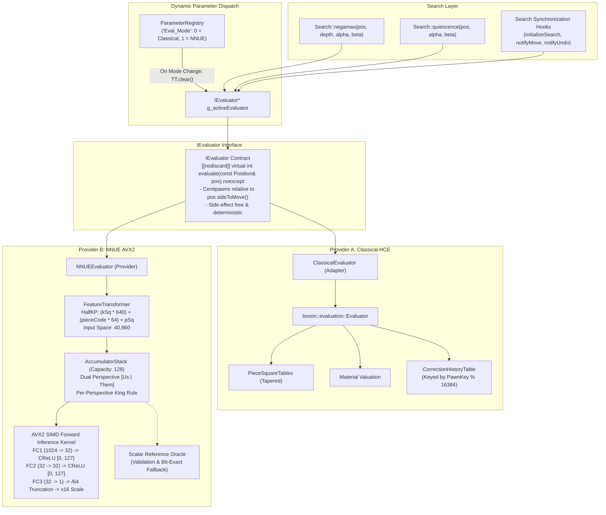
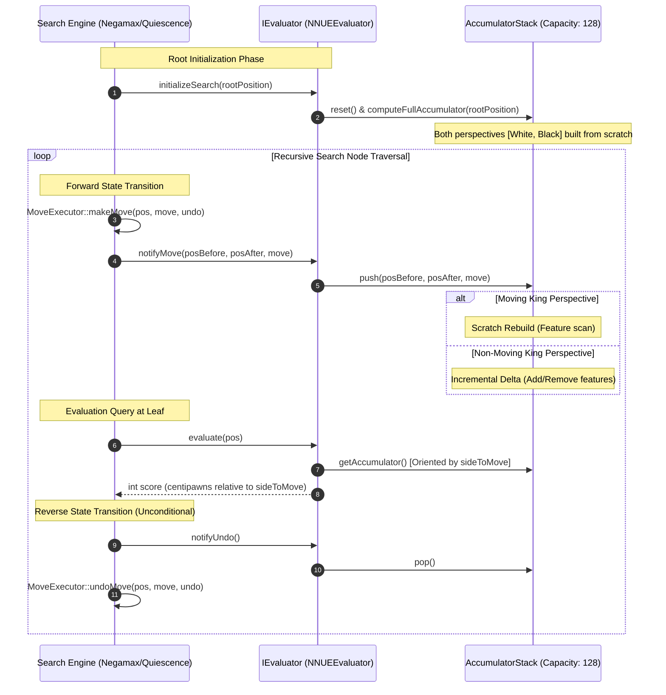

# Engine Architecture, Subsystem Boundaries & System Map

This document defines the structural layout, component boundaries, interface contracts, cryptographic file metadata, and verification oracles of the Boson chess engine.

---

## 1. Architectural Philosophy & Layer Hierarchy

Boson enforces strict downstream dependencies across five decoupled tiers:

```
[ Application & CLI Layer (UCI, Options, Bench Router) ]
                           │
                           ▼
[ Configuration & Parameter Registry (Observer Bus) ]
                           │
                           ▼
         [ Search & Orchestration Layer ]
                           │
                           ▼
       [ Abstract Evaluation Subsystem (IEvaluator) ]
          ├── Classical HCE (Material + PST + CorrHist)
          └── NNUE AVX2 (HalfKP + AccumulatorStack + SIMD)
                           │
                           ▼
                [ Board & Move Core ]
```

### Downstream Dependency Invariants
1. **Unidirectional Flow:** Higher layers depend on lower-layer interfaces; lower layers must never include, reference, or callback into higher layers.
2. **Subsystem Encapsulation:** Subsystems interact only through declared public APIs; internal representations, SIMD vectors, cache structures, and scratch buffers remain strictly encapsulated.
3. **Zero Dynamic Allocation in Search:** All state mutation during tree search occurs on stack-allocated positions, stack-allocated `UndoState` structs, and fixed-capacity arrays.

---

## 2. Directory & Module Topology

```
Boson/
├── engine/                                   # Core Engine Implementation
│   ├── CMakeLists.txt                        # C++23 build configuration (/arch:AVX2 on vectorized kernels)
│   ├── include/                              # Public subsystem headers
│   │   ├── benchmark/                        # Deterministic Benchmarking Subsystem
│   │   │   ├── BenchmarkCorpus.hpp           # 6 canonical test positions (startpos, kiwipete, WAC, etc.)
│   │   │   ├── BenchmarkReporter.hpp         # 4-section console and JSON telemetry serialization
│   │   │   ├── BenchmarkRunner.hpp           # Isolated and Persistent benchmark execution controller
│   │   │   └── BenchmarkTypes.hpp            # Deterministic vs. environmental telemetry metrics
│   │   ├── board/                            # Board Representation & Transactional Core
│   │   │   ├── Bitboard.hpp                  # 64-bit occupancy bitboards and bit manipulation primitives
│   │   │   ├── Castling.hpp                  # Strongly-typed CastlingRights bitmask constants
│   │   │   ├── Color.hpp                     # Color enum (White, Black) with inversion operators
│   │   │   ├── Move.hpp                      # 16-bit packed move encoding (from, to, type, promo)
│   │   │   ├── MoveExecutor.hpp              # Transactional makeMove / undoMove state machine
│   │   │   ├── MoveGenerator.hpp             # Legal move generator, sliding ray tables, leaper masks
│   │   │   ├── MoveList.hpp                  # Fixed-capacity stack-allocated legal move buffer
│   │   │   ├── Piece.hpp                     # Strongly-typed Piece enum (12 piece representations)
│   │   │   ├── Position.hpp                  # Domain position class owning 12 piece & 3 occupancy masks
│   │   │   ├── Square.hpp                    # Square enum (0..63) with rank-file coordinate utilities
│   │   │   └── UndoState.hpp                 # Reversible state record (castling, EP, 50-move, Zobrist)
│   │   ├── config/                           # Dynamic Engine Configuration & Tuning Subsystem
│   │   │   ├── EngineParameters.hpp          # Unified search, evaluation, and time parameter snapshot
│   │   │   └── ParameterRegistry.hpp         # Runtime UCI parameter registration, CLI router, observer bus
│   │   ├── debug/                            # Visualization & Board Diagnostics
│   │   │   └── BoardPrinter.hpp              # Unicode ASCII and ANSI terminal board visualizer
│   │   ├── eval/                             # Modern Abstracted Evaluation Subsystem
│   │   │   ├── ClassicalEvaluator.hpp        # Concrete HCE adapter implementing IEvaluator
│   │   │   ├── IEvaluator.hpp                # Abstract evaluation contract and search lifecycle hooks
│   │   │   └── nnue/                         # Neural Network Evaluation Subsystem
│   │   │       ├── Accumulator.hpp           # 64-byte aligned dual-perspective accumulator buffers
│   │   │       ├── AccumulatorStack.hpp      # Capacity-128 incremental accumulator stack
│   │   │       ├── AVX2Accumulator.hpp       # AVX2 SIMD incremental delta update & scratch rebuild
│   │   │       ├── AVX2Inference.hpp         # AVX2 SIMD vectorized feed-forward neural inference
│   │   │       ├── FeatureTransformer.hpp    # Canonical 40,960 HalfKP sparse feature transformer
│   │   │       ├── NetworkModel.hpp          # Binary serialization, memory management, header parser
│   │   │       ├── NNUEEvaluator.hpp         # Concrete NNUE provider implementing IEvaluator
│   │   │       ├── NNUETypes.hpp             # HalfKP constants, layer dimensions, alignas specifications
│   │   │       ├── ScalarInference.hpp       # Bit-exact scalar reference inference oracle
│   │   │       └── Sha256.hpp                # In-engine FIPS 180-4 cryptographic hash engine
│   │   ├── evaluation/                       # Handcrafted Classical Evaluation Core
│   │   │   ├── CorrectionHistoryTable.hpp    # Dynamic pawn-structure keyed evaluation bias compensator
│   │   │   ├── Evaluator.hpp                 # Material and tapered Piece-Square Table evaluator
│   │   │   └── PieceSquareTables.hpp         # Middlegame and endgame positional score tables
│   │   ├── fen/                              # FEN Tokenizer & Serializer
│   │   │   └── FenParser.hpp                 # Six-stage decoupled FEN parser returning std::optional
│   │   ├── search/                           # Lookahead Search & Heuristics Subsystem
│   │   │   ├── ContinuationHistoryTable.hpp  # 2-Ply Continuation History matrix [12][64][64]
│   │   │   ├── CounterMoveTable.hpp          # Counter-Move History table [12][64]
│   │   │   ├── LMR.hpp                       # Logarithmic reduction constant definitions
│   │   │   ├── LMRPolicy.hpp                 # Precalculated 2D LMR table and dynamic reduction queries
│   │   │   ├── MoveOrderer.hpp               # Staged move ordering and heuristic priority sorting
│   │   │   ├── MovePicker.hpp                # Lazy pull-based staged move picking state machine
│   │   │   ├── PVLine.hpp                    # Principal Variation storage structure
│   │   │   ├── Search.hpp                    # Alpha-Beta Negamax, PVS, Aspiration Windows, Quiescence
│   │   │   ├── SearchController.hpp          # Asynchronous search coordinator, stop tokens, telemetry
│   │   │   ├── SearchLimits.hpp              # Movetime, depth, node, and clock limits specification
│   │   │   ├── SearchStatistics.hpp          # Search tree node counts, TT hits, NPS, PV line
│   │   │   ├── TimeManager.hpp               # Dynamic soft and hard move time allocation mathematics
│   │   │   ├── TranspositionTable.hpp        # 64-bit cluster hash table with depth/age replacement
│   │   │   ├── Zobrist.hpp                   # Incremental 64-bit pseudorandom hashing keys
│   │   │   └── see/                          # Static Exchange Evaluation Subsystem
│   │   │       └── SEE.hpp                   # Standalone recursive tactical capture swap simulator
│   │   ├── system/                           # Host Platform & System Information
│   │   │   └── EngineInfo.hpp                # Compiler, CPU architecture, ISA features detection
│   │   └── validation/                       # State Invariant & Semantic Verification
│   │       └── VerificationHarness.hpp       # Perft runner, make-undo symmetry assertions
│   └── src/                                  # Translation units corresponding to include/
│       ├── main.cpp                          # Engine CLI entry point, benchmark router, UCI protocol loop
│       ├── benchmark/                        # BenchmarkCorpus.cpp, BenchmarkReporter.cpp, BenchmarkRunner.cpp
│       ├── board/                            # MoveExecutor.cpp, MoveGenerator.cpp, Position.cpp
│       ├── config/                           # ParameterRegistry.cpp
│       ├── debug/                            # BoardPrinter.cpp
│       ├── eval/                             # ClassicalEvaluator.cpp, AccumulatorStack.cpp, AVX2Accumulator.cpp,
│       │                                     # AVX2Inference.cpp, FeatureTransformer.cpp, NetworkModel.cpp,
│       │                                     # NNUEEvaluator.cpp, ScalarInference.cpp
│       ├── evaluation/                       # Evaluator.cpp, PieceSquareTables.cpp
│       ├── fen/                              # FenParser.cpp
│       ├── search/                           # MoveOrderer.cpp, MovePicker.cpp, Search.cpp,
│       │                                     # TranspositionTable.cpp, Zobrist.cpp, SEE.cpp
│       └── validation/                       # VerificationHarness.cpp
├── tests/                                    # Verification Battery, Quality Gates, & Suites
│   ├── TestRunner.cpp                        # Main test driver executing 34 validation suites
│   ├── benchmark/                            # Benchmark test adapters
│   ├── integrity/                            # Move generation and state rollback integrity suites
│   ├── strength/                             # Strength & Elo sequential validation harness
│   │   ├── MatchRunner.hpp / .cpp            # In-process UCI match orchestrator & adjudicator
│   │   ├── OpeningBook.hpp / .cpp            # 50-opening canonical book with color-alternating scheduler
│   │   ├── Statistics.hpp / .cpp             # Wilson intervals, logistic Elo, Wald SPRT engine
│   │   ├── StrengthReporter.hpp / .cpp       # ASCII table and JSON telemetry reporter
│   │   └── StrengthTypes.hpp                 # Match records, termination states, configuration structs
│   └── tactical/                             # EPD test datasets (perft_suite.epd, wac.epd)
├── docs/                                     # Architectural Charters & Subsystem Specifications
├── scripts/                                  # CI & Build automation scripts
├── tools/                                    # Offline training, tuning, and EPD tools
├── CHANGELOG.md                              # Historical milestone release ledger
├── LICENSE                                   # MIT License
└── README.md                                 # Project landing page and quickstart guide
```

---

## 3. Critical Component Metadata Registry (SHA-256)

Every critical engine translation unit and header is cataloged with its cryptographic hash and architectural invariant:

| Subsystem | Relative Path | SHA-256 Digest | Size (B) | Role & Invariants |
|---|---|---|---|---|
| **Core** | `engine/src/main.cpp` | `dcb1766a0b9db88dbedbb90cba9f951797e4fc087dc990fb7f8d50800d0397ca` | 6,349 | CLI dispatch, UCI protocol loop, `--require-nnue` fail-fast guard |
| **Config** | `engine/include/config/ParameterRegistry.hpp` | `0573d79c7bba5683285f9eb8c3b2fc969a8a319203b48ed89580f8488ab76eb6` | 8,268 | Dynamic parameter registration, observer callbacks, UCI option sync |
| **Config** | `engine/src/config/ParameterRegistry.cpp` | `01bee6caf28c8ca8c18ede2f1e2c82db1c76c1e75d798d519d895f136392fde6` | 22,445 | Thread-safe singleton registry implementation and reset router |
| **Eval API** | `engine/include/eval/IEvaluator.hpp` | `33e1e86272add0c20bfb53f84bbb25fe3a250b8960a586fb26800cb81e0afbb0` | 774 | Abstract evaluation contract & search lifecycle synchronization hooks |
| **Eval API** | `engine/include/eval/ClassicalEvaluator.hpp` | `b6cf0afd791aa9989f73e01a1bb4d41522d7a749ca0dfe3e3d7cb77594074bdb` | 775 | Concrete HCE adapter implementing `IEvaluator` |
| **Eval API** | `engine/src/eval/ClassicalEvaluator.cpp` | `e526c8a1c9a551beff24b1bdfa6ea08228a737daeff480ab6679649e1afe32fa` | 779 | Delegates `evaluate()` to classical material + PST + CorrHist |
| **NNUE** | `engine/include/eval/nnue/NNUEEvaluator.hpp` | `408bd28f80332e6af6f057c7ab3ffbb644f424ca66ab04e8a0c9d8e4622a25f2` | 2,486 | Concrete NNUE provider; owns model state, accumulator stack, AVX2 dispatch |
| **NNUE** | `engine/src/eval/nnue/NNUEEvaluator.cpp` | `62f72dc34a175ca366bfa9d71c5469665330353f387c1e21b1faa36395470a18` | 9,707 | Strict model ingestion, fail-fast exit on invalid model, search lifecycle sync |
| **NNUE** | `engine/include/eval/nnue/Accumulator.hpp` | `659a95f2a58a0d2484c37854b989e21d8431361936f578fe2abf46ffb65d6014` | 1,708 | 64-byte aligned `AccumulatorHalf` and `Accumulator` dual-perspective structures |
| **NNUE** | `engine/include/eval/nnue/AccumulatorStack.hpp` | `d763ac8d6f46865befbca3bf12a5399233d561c5ab37766555b8f6295582ab24` | 1,496 | Capacity-128 incremental accumulator stack interface with reversible push/pop |
| **NNUE** | `engine/src/eval/nnue/AccumulatorStack.cpp` | `10cbec9b2b7ddce96a291937f5d5c157e8201cfaf74f4e1542084996a01c320e` | 5,646 | Incremental accumulator push/pop, delta calculation, per-perspective king rule |
| **NNUE** | `engine/include/eval/nnue/AVX2Accumulator.hpp` | `cf8e7605a29ca9e72455e42909b6796ea5a6151376575efdefc7b49dfd4b0893` | 1,085 | Declarations for SIMD-accelerated accumulator updates and rebuilds |
| **NNUE** | `engine/src/eval/nnue/AVX2Accumulator.cpp` | `b9fe1047425a2a87655b81ecf41920a690195010a5198b0db748c352844e4745` | 3,809 | AVX2 SIMD incremental delta updates with 32-bit unpacked arithmetic |
| **NNUE** | `engine/include/eval/nnue/AVX2Inference.hpp` | `6ebb0b08093ec6cc908b1dec1a51408bc3d0c849ad56fc61991bbc806573068a` | 1,968 | Vectorized forward inference interface (1024 $\to$ 32 $\to$ 32 $\to$ 1) |
| **NNUE** | `engine/src/eval/nnue/AVX2Inference.cpp` | `e71a4047d5a85925265c893b28c768fc9d00068af32bd57e2092c33fcf9cd9b8` | 7,712 | High-performance AVX2 dot-product and CReLU integer vector inference |
| **NNUE** | `engine/include/eval/nnue/FeatureTransformer.hpp` | `66044a838882cf9accdbc2671ca52001fecd866e31b51a49ac677fcdccad4a29` | 854 | Canonical HalfKP sparse feature transformer interface (40,960 features) |
| **NNUE** | `engine/src/eval/nnue/FeatureTransformer.cpp` | `1c1ff5506c4cb1b13919fe6d03c361ab4b2f3de1dc0bd3c4d797f1d747578f83` | 6,290 | HalfKP feature calculation, perspective rank mirroring ($sq \oplus 56$), delta tracking |
| **NNUE** | `engine/include/eval/nnue/NetworkModel.hpp` | `90fed98b45e57c0bef1652fc845b415ffb0caff11299b95f7a3e002d27be18e0` | 1,777 | Memory-safe `NetworkModel` representation owning `FeatureWeights` (~41.9 MB) |
| **NNUE** | `engine/src/eval/nnue/NetworkModel.cpp` | `92bbc794a5ad6277f6e2866605ac9f18aeafa8df11d6ef1ec1b0111fac617cb6` | 6,098 | Little-endian binary SerDe, magic/version/dimension header validation |
| **NNUE** | `engine/include/eval/nnue/NNUETypes.hpp` | `2931332ed649cbf224bbce6009a4e9959e10d30549dd2230f317489cc36632aa` | 1,916 | HalfKP dimension constants, alignment macros, layer weight structs |
| **NNUE** | `engine/include/eval/nnue/ScalarInference.hpp` | `deada63f202e9011f1e39025fbf79a0994dcb8d4b6bdf42052ebbb655a20646b` | 1,453 | Bit-exact scalar reference forward inference declarations |
| **NNUE** | `engine/src/eval/nnue/ScalarInference.cpp` | `f8bc1146f4f08c16974480bcb9cd7194d874d283d95bfb5ad1eadfea8b6c7685` | 2,510 | Bit-exact scalar forward pass (CReLU $[0, 127]$, $/64$ truncation, $\times 16$ output) |
| **HCE** | `engine/include/evaluation/Evaluator.hpp` | `ec8821ef97dcaff1de9a6f65441657ed2d727183dbd370119127eddcca6fb6af` | 1,181 | Classical handcrafted evaluator API (material + PST + phase tapering) |
| **HCE** | `engine/src/evaluation/Evaluator.cpp` | `8ed2570170f62576a1fd6949f3d98e5c83de0e29e3b2b47df2206432ff8034e6` | 4,817 | Material score accumulation and tapered king-safety interpolation |
| **HCE** | `engine/include/evaluation/PieceSquareTables.hpp` | `eba870d66c5994a56ca5d05cbd1974d474229ef0bb931d46d79ec5b9e6815065` | 662 | Canonical PST arrays (White perspective) and rank-mirroring lookup macro |
| **HCE** | `engine/src/evaluation/PieceSquareTables.cpp` | `e5de66159e71d438e1185a208a0dee6c252e6c0d95af08b719812b1cdd1a81ba` | 3,563 | Middlegame and endgame PST valuation definitions |
| **HCE** | `engine/include/evaluation/CorrectionHistoryTable.hpp` | `7cad29e699031291ecb427aea481cfb031262c04ca37766ab3aa1187598e9c70` | 4,221 | Pawn-structure keyed evaluation correction table (16,384 entries per color) |
| **Search** | `engine/include/search/Search.hpp` | `dd644f77ea17539e716c06e4ebd26faf5882556d11c9043358a6d0fac8922a88` | 4,639 | Search engine driver declarations, `setEvaluatorMode`, static search state |
| **Search** | `engine/src/search/Search.cpp` | `0d066c845c0078a3f0ca598be0f357cd50fffd81ad0736c5d94017e77f077aa7` | 29,670 | Alpha-Beta Negamax, PVS, Quiescence, RFP, NMP, LMR, Evaluator synchronization |
| **Search** | `engine/include/search/MovePicker.hpp` | `ee5fe87d5b0dc9f5279a0ec9d22021c80db55ea083706acc36f64d1c9d1d6a01` | 3,100 | Staged lazy move generator state machine interface |
| **Search** | `engine/src/search/MovePicker.cpp` | `41e0be3a7378abc8cf2da686036b81b12813e452086037a31677e9e13f1055c6` | 17,394 | 8-stage move picker implementation (TT $\to$ GoodCaptures $\to$ Quiets $\to$ BadCaptures) |
| **Search** | `engine/include/search/TranspositionTable.hpp` | `808fbb0ea14b2c6e322b069e21f11b0eb284e33bd0f6d5b79b5df789b11c7aa2` | 1,597 | Cluster-based 64-bit TT entry layout and probe/store interfaces |
| **Search** | `engine/src/search/TranspositionTable.cpp` | `cd49fa3c8b0d516c373d9e80bf40eeb7ab2332b303a53cee66db9dc080096059` | 2,522 | TT allocation, power-of-two index hashing, age-depth replacement strategy |
| **Search** | `engine/include/search/see/SEE.hpp` | `af7aba9edc78926766ae75da6c604a9521408729c01f56cbb42d1f04bf3ebddc` | 741 | Pure Static Exchange Evaluation lookahead swap simulation declarations |
| **Search** | `engine/src/search/see/SEE.cpp` | `a3d60e11453548df8bda565ec2c23bf3f42b3bff45f5a27729a04268b0413c9d` | 8,164 | Fast recursive capture evaluation with bitboard attacker discovery |
| **Board** | `engine/include/board/Position.hpp` | `8f8bac4d87ea08d69229cbdf40079b7a899786a074b2b6589f7b753d97ed146b` | 4,770 | Pure board state holder (12 piece bitboards, 3 occupancies, castling, Zobrist) |
| **Board** | `engine/src/board/Position.cpp` | `b411157997bcb074b2d967f3b6aaebe427596cf36a47a4a25023fbf0b12f10ab` | 6,204 | Position value semantics, equality operators, bitboard consistency invariants |
| **Board** | `engine/include/board/MoveExecutor.hpp` | `4324fdbbfa1e17c093aee979b0c2a71bf64f6990666d9b4db73cb9e93ae34293` | 1,073 | Transactional state machine declarations for `makeMove` and `undoMove` |
| **Board** | `engine/src/board/MoveExecutor.cpp` | `9b7220886679fd502621194f2605f1bcb77ea74fb3ab563ffcf42b414a2062b2` | 9,178 | Bit-exact deterministic state rollback using stack-allocated `UndoState` |
| **Board** | `engine/include/board/MoveGenerator.hpp` | `2e088ee3d6706e5cfca7df76f181656e133ff711100366ebf0103e67041a7985` | 2,752 | Legal move generation and precomputed ray attack table declarations |
| **Board** | `engine/src/board/MoveGenerator.cpp` | `47278e0336352ecd85c4c28d8a9b42b0b4c21f8f70b668664652ca07787ed3e7` | 29,251 | Highly optimized sliding attacks, knight/king jumps, pawn moves, pin filtering |
| **FEN** | `engine/include/fen/FenParser.hpp` | `3d330acb0ec2451a51b66e3ddf4c24f58ac29a1f0122e6d58fcb0353072f33d3` | 1,587 | Six-stage decoupled FEN parser declarations returning `std::optional<Position>` |
| **FEN** | `engine/src/fen/FenParser.cpp` | `bc390ca0cfea9ec12ca8a0a182235a1b15370f05cba81816cd428f932406141c` | 7,285 | Fast tokenized FEN string parsing and coordinate validation |
| **Benchmark** | `engine/include/benchmark/BenchmarkRunner.hpp` | `625aa53b26c61f227c4d758652c77d6124ad554f6c4d7e29bb3e3a35ee025b33` | 1,029 | Deterministic benchmark execution engine API |
| **Benchmark** | `engine/src/benchmark/BenchmarkRunner.cpp` | `df50f956980cd06d09588dba3cf13a2d57775231d80128323c1e0e99ec210954` | 5,742 | Execution across 6 canonical positions, isolated state clearing, telemetry logging |

---

## 4. Layered Evaluation Pipeline Architecture



---

## 5. Search Integration Lifecycle Contract

`IEvaluator` specifies an explicit, zero-allocation search synchronization lifecycle to guarantee accumulator consistency without silent fallback rebuilding:



### Lifecycle Invariant Rules:
1. **Universal Scoring Contract:** Both `ClassicalEvaluator` and `NNUEEvaluator` return centipawns strictly relative to `pos.sideToMove()`.
2. **Null-Move Invariance (Gate 7-E-11):** Across null moves, accumulators are bit-exact preserved with perspective inversion matching side-to-move semantics:
   $$\text{Accumulator}_{\text{Null}}.\text{us} \equiv \text{Accumulator}_{\text{Parent}}.\text{them}$$
   $$\text{Accumulator}_{\text{Null}}.\text{them} \equiv \text{Accumulator}_{\text{Parent}}.\text{us}$$
3. **Unconditional Reversion:** `notifyUndo()` is executed symmetrically with `MoveExecutor::undoMove()` upon every subtree unwind before examining termination conditions.

---

## 6. Canonical Verification Oracles

| Oracle Identifier | Target Subsystem | Metric / Acceptance Threshold | Canonical Baseline | Status |
|---|---|---|---|---|
| **Classical Benchmark Oracle** | Search & Classical HCE | `boson bench --depth 6 --mode isolated` | **Exactly 313,092 nodes** ($\Delta = 0$) | **LOCKED** |
| **AVX2 Differential Oracle** | NNUE Forward Inference | 10,000 diverse reachable positions | **0 discrepancies** across all layers | **LOCKED** |
| **HalfKP Equivalence Oracle** | Feature Transformer | 10,000-ply random legal walks | $(\text{Features}_A \setminus \text{Rem}) \cup \text{Add} \equiv \text{Features}_B$ | **LOCKED** |
| **Accumulator Invariance Oracle** | Accumulator Stack | Reversible random walks | $A_{\text{incremental}} \equiv A_{\text{rebuild}}$ bit-for-bit | **LOCKED** |
| **Model Ingestion Gate 7-G-2A** | CLI / Model Loader | `--require-nnue` on missing/invalid model | Immediate fail-fast `std::exit(1)` | **LOCKED** |
| **Full Regression Battery** | Complete Engine | `boson_tests.exe` (34 test suites) | **34/34 suites passing cleanly** | **LOCKED** |