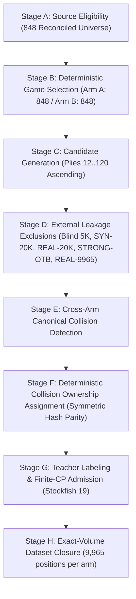

# BOSON B3-OTB-2: Q4 Design Amendment Draft 1
**Final-Admitted Canonical Disjointness Protocol**  
**Amendment Identifier:** `B3-OTB-2-Q4-A1`  
**Status:** `Q4 AMENDMENT DRAFT 1 — PENDING GPT-1 REVIEW (NOT YET RATIFIED)`  
**Design Phase:** Design-Only Specification (Zero Downstream Execution Authorized)

---

> [!IMPORTANT]
> **GOVERNANCE & RATIFICATION STATUS:**  
> *"This is a superseding design amendment draft and is not authorized for execution until GPT-1 architectural approval and formal ratification."*  
> **ABSOLUTE EPISTEMIC BOUNDARY:**  
> *"Q4 establishes the theoretical and structural architecture for cross-arm disjointness only. Pre-label candidate feasibility and post-label finite-CP feasibility remain strictly governed by sequential authorization gates."*

---

## 1. Amendment Lineage & Purpose

### 1.1 Authoritative Upstream Lineage
This design amendment directly succeeds the closed Q3 structural audit and supersedes the cross-arm candidate reservation mechanism of ratified Q2.3:

| Artifact Lineage | Path | SHA-256 Digest | State |
| :--- | :--- | :--- | :---: |
| **Parent Specification (Q2.3)** | [`docs/B3_OTB_2_SUPERSEDING_DESIGN_SPEC_Q2_3_DRAFT.md`](file:///C:/Users/Dell/Desktop/Programming/Project/Boson/docs/B3_OTB_2_SUPERSEDING_DESIGN_SPEC_Q2_3_DRAFT.md) | `08f7ece7cb47967890690b7d2c007973fe2c2a25df4df6470feec02fc23438af` | `FROZEN PARENT` |
| **Parent Machine Manifest (Q2.3)** | [`data/b3_otb_2/superseding_design_manifest_q2_3_draft.json`](file:///C:/Users/Dell/Desktop/Programming/Project/Boson/data/b3_otb_2/superseding_design_manifest_q2_3_draft.json) | `b3c06d2032b79e5dbf96764699347b104100d5d1c6d4165b2e894e630e270b95` | `FROZEN PARENT` |
| **Q3 Feasibility Audit Spec** | [`docs/B3_OTB_2_Q3_PRELABELING_FEASIBILITY_AUDIT_SPEC.md`](file:///C:/Users/Dell/Desktop/Programming/Project/Boson/docs/B3_OTB_2_Q3_PRELABELING_FEASIBILITY_AUDIT_SPEC.md) | `a89eb39684c1f5cd5011e12473a46d43f847ba6628ca3d16f5a29ecb45b3963c` | `Q3 CLOSED` |
| **Q3 Feasibility Audit Manifest** | [`data/b3_otb_2/q3_prelabeling_feasibility_manifest.json`](file:///C:/Users/Dell/Desktop/Programming/Project/Boson/data/b3_otb_2/q3_prelabeling_feasibility_manifest.json) | `afacd586f17f884537a1d088d42fd9bd188f7246295fbd285b286d103349c831` | `Q3 CLOSED` |
| **Q3 Feasibility Audit Report** | [`docs/B3_OTB_2_Q3_PRELABELING_FEASIBILITY_AUDIT_REPORT.md`](file:///C:/Users/Dell/Desktop/Programming/Project/Boson/docs/B3_OTB_2_Q3_PRELABELING_FEASIBILITY_AUDIT_REPORT.md) | `147a1abb30a244af708b7e4d8acb8bb4aa947ce1e6a0cbc6e87e82f65c2ec3ff` | `Q3 CLOSED` |
| **Frozen Blind Benchmark** | [`data/b3a_blind_test/blind_positions_labeled.json`](file:///C:/Users/Dell/Desktop/Programming/Project/Boson/data/b3a_blind_test/blind_positions_labeled.json) | `d8934c5c90d93bf6a8885d56f5d2c24f247466c9b8d33a45ccf5ea3865a5dc82` | `IMMUTABLE` |
| **Production NNUE Model** | [`models/boson-v2.nnue`](file:///C:/Users/Dell/Desktop/Programming/Project/Boson/models/boson-v2.nnue) | `ef3386104547109445a47257c85afd99beef3cadbf7766566244e76a040dae92` | `IMMUTABLE` |

### 1.2 Q3 Closure State & Motivation for Q4
The Q3 Pre-Labeling Feasibility Audit closed with:
$$\mathbf{STATUS: FAIL-CLOSED}$$

Authoritative Q3 findings:
* **Arm A:** 848 / 848 source games structurally feasible ($64,649$ final structural candidates).
* **Arm B:** 651 / 848 source games structurally feasible ($46,634$ final structural candidates).
* **Structural Shortfalls:** Exactly **197 games** yielded $c < K$ (170 Carlsen, 24 Anand H2H, 2 Ding, 1 Caruana).
* **Root Cause:** The Q2.3 pre-label reservation protocol placed **all candidate plies ($12 \le \text{ply} \le 120$)** of all 848 Carlsen games into reservation set $R_A$ ($|R_A| = 62,456$). When Arm-B candidates were filtered against $R_A$, 100% of candidate positions in all 170 Carlsen games were rejected, creating an artificial structural candidate depletion prior to teacher labeling.

### 1.3 Purpose of Q4 Amendment
The purpose of Amendment `B3-OTB-2-Q4-A1` is to resolve this structural collision by **replacing the whole-stream pre-label reservation mechanism with a Final-Admitted Canonical Disjointness Protocol**, while preserving every scientific variable, population, source rule, teacher parameter, and statistical inferential contract.

---

## 2. Unchanged Scientific Question

The core scientific inquiry remains identical in substance to parent specifications Q1, Q2.1, Q2.2, and Q2.3:

> *"Under identical NNUE architecture, teacher, training volume, initialization, optimization, and training budget, does replacing a Carlsen-only real-game training composition with a diversified multi-elite real-game composition change out-of-sample static-evaluation error on the same frozen blind population?"*

* **Independent Variable:** Training corpus composition (Arm A: Carlsen-only classical OTB vs. Arm B: 5-player multi-elite classical OTB).
* **Dependent Variable:** Paired out-of-sample static evaluation error ($\Delta_i$) against the frozen Common Blind Benchmark.
* **Leakage Mechanism Role:** The cross-arm leakage prevention mechanism is an engineering integrity invariant, **not** the scientific independent variable.

---

## 3. Immutable Controls vs. Amended Variable

| Category | Parameter / Contract | Q2.3 Frozen Value | Q4 Amendment Status |
| :--- | :--- | :--- | :---: |
| **Scientific Population** | Arm A Composition | Exclusively Magnus Carlsen | **IMMUTABLE** |
| **Scientific Population** | Arm B Composition | Anand, Carlsen, Caruana, Ding, Nakamura | **IMMUTABLE** |
| **Source Corpora** | Basis & Reconciled Universe | PGN Mentor + TWIC (848 games) | **IMMUTABLE** |
| **Source Rules** | Era Window | 2013-01-01 through 2025-12-31 inclusive | **IMMUTABLE** |
| **Source Rules** | Time Control & Legality | Classical OTB only; strict legality check | **IMMUTABLE** |
| **Cohort Allocations** | Arm A Volume Quota | 848 source games, 9,965 finite-CP positions | **IMMUTABLE** |
| **Cohort Allocations** | Arm B Volume Quotas | 848 games total; 1,993 finite-CP pos / player | **IMMUTABLE** |
| **Cohort Allocations** | Arm B Game Quotas | Anand 170, Carlsen 170, Caruana 170, Ding 169, Nakamura 169 | **IMMUTABLE** |
| **H2H Governance** | Cross-Player Ownership | Lexicographical min(canonical_player_id) | **IMMUTABLE** |
| **Candidate Plies** | Candidate Ply Semantics | Plies 12..120 inclusive, 1-based ascending | **IMMUTABLE** |
| **Position Identifiers**| Format & Provenance | `<source_game_key>:<ply>` | **IMMUTABLE** |
| **Board Normalization** | Canonical Board Key | 4-field FEN with legal en-passant normalization | **IMMUTABLE** |
| **Teacher Contract** | Engine & Evaluation Settings| Stockfish 19 (`edb0d9d`, `45bc8e49...`, `go_nodes 100000`) | **IMMUTABLE** |
| **Training Contract** | NNUE Topology & Optimizer | HalfKP 1024->32->32->1, AdamW, lr=0.001 | **IMMUTABLE** |
| **Statistical Contract**| Benchmark & Bootstrap | Frozen Blind 5K (`d8934c5c...`), 10,000 resamples, seed 42 | **IMMUTABLE** |
| **Production Model** | Frozen Model Artifact | `models/boson-v2.nnue` (`ef338610...`) | **IMMUTABLE** |
| **Cross-Arm Leakage** | **Candidate Reservation Protocol** | **Whole-stream pre-label reservation $R_A$** | **EXPLICITLY AMENDED** |

---

## 4. Amended Leakage Model

### 4.1 Four Distinct Levels of Overlap
To eliminate confusion, the specification establishes strict taxonomy across four distinct levels:

1. **Level 1: Source GameKey Overlap ($\text{Games}_A \cap \text{Games}_B \neq \emptyset$):**  
   * **Permitted by Design.** Magnus Carlsen is the sole subject of Arm A and an allocated member of Arm B. Exactly 170 Carlsen games (plus any H2H games where Carlsen was involved) are shared between source game selections.
2. **Level 2: Candidate Position Overlap ($\text{Cands}_A \cap \text{Cands}_B \neq \emptyset$):**  
   * **Permitted at Stream Generation.** Both arms generate raw structural candidate plies ($12 \le \text{ply} \le 120$) from their selected games.
3. **Level 3: Candidate Canonical Board Overlap ($\text{Keys}(\text{Cands}_A) \cap \text{Keys}(\text{Cands}_B) \neq \emptyset$):**  
   * **Expected in Candidate Pool.** Identical board states occur naturally across shared games and common opening transpositions.
4. **Level 4: Final Admitted Position Overlap ($\text{Keys}(D_A) \cap \text{Keys}(D_B) = \emptyset$):**  
   * **Strictly Prohibited ($\text{Intersection} \equiv \emptyset$).** No canonical board state may appear in both final training sets $D_A$ and $D_B$.

### 4.2 Supersession of Q2.3 Reservation Protocol
* **Superseded Rule:** The Q2.3 protocol constructed $R_A = \{\text{canonical\_board\_key}(c) \mid c \in \text{Full\_Arm\_A\_Candidate\_Stream}\}$ before teacher labeling, rejecting any Arm-B candidate belonging to $R_A$.
* **Amended Rule:** Both candidate streams are generated independently under frozen source eligibility and external historical/blind filters. Zero canonical board overlap is enforced at final dataset admission through a deterministic, symmetric collision-ownership protocol:
$$\text{Keys}(D_A) \cap \text{Keys}(D_B) \equiv \emptyset$$

---

## 5. Collision Ownership Protocol

### 5.1 Design Constraints
A valid collision-ownership protocol must satisfy:
1. **Symmetry:** Neither arm holds an intrinsic structural priority over shared positions.
2. **Determinism:** Bit-for-bit reproducible across independent executions.
3. **Teacher Independence:** Must **never** inspect Stockfish evaluation, centipawn value, win/draw/loss probability, or finite vs. forced mate classification.
4. **Model & Benchmark Independence:** Must **never** inspect NNUE output or blind benchmark performance.
5. **Static Grounding:** Governed solely by pre-frozen namespace and the canonical board state.

### 5.2 Proposed Exact Mechanism: Symmetric Cryptographic Hash Parity
For any candidate board state $k = \text{canonical\_board\_key}$ that appears in the candidate streams of both Arm A and Arm B:

1. **Namespace Prefix:** `B3-OTB-2-Q4-COLLISION-v1:`
2. **Hash Computation:**
   $$\text{digest} = \text{SHA256}(\text{"B3-OTB-2-Q4-COLLISION-v1:"} \mathbin{\Vert} k)$$
3. **Ownership Parity:** Extract the first 8 hexadecimal characters (32-bit unsigned integer):
   $$\text{val} = \text{int}(\text{digest}[0:8], 16)$$
   $$\text{Owner}(k) = \begin{cases} \text{Arm A}, & \text{if } \text{val} \pmod 2 == 0 \\ \text{Arm B}, & \text{if } \text{val} \pmod 2 == 1 \end{cases}$$
4. **Execution Invariant:** If $\text{Owner}(k) == \text{Arm A}$, candidate position $k$ is exclusively available to Arm A and prohibited from admission into Arm B. If $\text{Owner}(k) == \text{Arm B}$, candidate position $k$ is exclusively available to Arm B and prohibited from admission into Arm A.

### 5.3 Edge Cases & Discard Policies
* **Non-Finite Teacher Score:** If $\text{Owner}(k)$ labels position $k$ and Stockfish returns a forced mate score (`|cp| >= 30000` or `mate`), position $k$ is rejected under Stage E (Mate Exclusions).  
  * **Strict Discard Invariant:** Position $k$ **remains burned and cannot be claimed by the non-owning arm**. Allowing the opposing arm to rescue a teacher-rejected position would make ownership teacher-dependent, violating scientific independence.
* **Within-Arm Multiple Plies:** If identical canonical keys occur at multiple plies within the same arm (e.g. threefold repetition), the earliest ply in ascending order is retained; subsequent duplicate plies are excluded.

---

## 6. Complete Final Admission Order (Eight Stages)

The full data-construction lifecycle proceeds through eight deterministic stages:

1. **Stage A (Source Eligibility):** PGN Mentor and TWIC sources filtered for classical OTB games in 2013–2025 era.
2. **Stage B (Deterministic Game Selection):** Arm A selects all 848 Carlsen games. Arm B selects 848 cohort games under lexicographical H2H ownership (Anand 170, Carlsen 170, Caruana 170, Ding 169, Nakamura 169).
3. **Stage C (Candidate Generation & Ordering):** Generate legal board positions for halfmove plies $12 \le \text{ply} \le 120$ in strictly ascending order.
4. **Stage D (External Historical & Blind Exclusions):** Exclude any candidate matching frozen blind benchmark or historical datasets (`SYN-20K`, `REAL-20K`, `STRONG-OTB`, `REAL-9965`).
5. **Stage E (Collision Detection):** Identify candidate canonical board keys present in both Arm A and Arm B candidate streams.
6. **Stage F (Collision Ownership Assignment):** Partition colliding keys deterministically via Symmetric Hash Parity.
7. **Stage G (Teacher Labeling & Finite-CP Admission):** Query Stockfish 19 in ascending ply order. Admit finite-CP positions (`|cp| < 30000`). Skip mate positions without reordering.
8. **Stage H (Exact-Volume Closure & Refill):** Continue sequential admission per game until game quota $K \in \{11, 12\}$ is satisfied. If a game exhausts eligible finite positions, apply deterministic refill strictly within the same player pool.

---

## 7. Structural Feasibility Gate (Q4-Audit)

Before authorized teacher labeling, a new structural feasibility audit must execute under Q4 rules:
* **Metric:** Final pre-label structural candidate capacity $c_{\text{struct}}$ per game.
* **Criterion:** Every assigned source game must satisfy $c_{\text{struct}} \ge K$ ($K \in \{11, 12\}$).
* **Failure-Closed Trigger:** If any selected game yields $c_{\text{struct}} < K$, or if any player quota (1,993 positions) cannot be fulfilled structurally, the audit terminates as **`FAIL-CLOSED`**.
* **Pre-Label Boundary:** The gate verifies *structural availability* only. Finite-CP availability remains unknown until authorized Stage G labeling.

---

## 8. Exact-Volume Closure Contract

* **Arm A Volume:** Exactly **9,965 finite-CP positions**.
* **Arm B Volume:** Exactly **9,965 finite-CP positions**.
* **Arm B Player Quotas:** Exactly **1,993 finite-CP positions per player** across all five cohort members ($5 \times 1,993 = 9,965$).
* **No Quota Reallocation:** Under failure-closed governance, position quotas cannot be shifted between players.

---

## 9. Leakage & Provenance Invariants

* **I1 (Provenance):** Every position traces to a valid source game in the frozen 848 universe.
* **I2 (Candidate ID):** Position identity format `<source_game_key>:<ply>` strictly preserved.
* **I3 (Canonical Board Key):** 4-field normalization with legal en-passant validation strictly enforced.
* **I4 (Final Canonical Disjointness):** $\text{Keys}(D_A) \cap \text{Keys}(D_B) \equiv \emptyset$.
* **I5 (Unambiguous Ownership):** Every colliding canonical key is assigned to exactly one arm.
* **I6 (Teacher Blindness):** Selection and collision resolution do not inspect teacher evaluations.
* **I7 (Model Blindness):** Selection does not inspect NNUE model weights or predictions.
* **I8 (Blind Benchmark Blindness):** Selection does not inspect blind benchmark error metrics.
* **I9 (Traceability):** Final training records contain full provenance metadata (`source_game_key`, `ply`, `canonical_key`, `eco`, `players`).
* **I10 (H2H Ownership):** Source game ownership governed strictly by frozen lexicographical ordering.

---

## 10. Statistical Inferential Contract

* **Primary Estimand:** Paired difference in out-of-sample absolute evaluation error:
  $$\Delta_i = |E_A(i) - T(i)| - |E_B(i) - T(i)|, \quad \bar{\Delta} = \frac{1}{N} \sum_{i=1}^N \Delta_i$$
* **Primary Benchmark:** Frozen Common Blind Benchmark (`data/b3a_blind_test/blind_positions_labeled.json`, $N=4,754$ positions, SHA-256: `d8934c5c...`).
* **Bootstrap Protocol:** Exactly 10,000 resamples with replacement, cluster unit `source_game_key`, deterministic seed `42`, 95% empirical percentile confidence interval.
* **Statistical Invariance:** The Q4 amendment preserves the sampling unit, cluster structure, and estimand without modification.

---

## 11. Confound Analysis & Mitigation Matrix

| Confound | Description | Potential Threat | Mitigation & Audit Requirement |
| :--- | :--- | :--- | :--- |
| **Asymmetric Ownership** | One arm systematically gaining more tactically rich colliding positions | Systematic evaluation bias | SHA-256 hash parity guarantees uniform 50/50 pseudo-random allocation. Audit E required. |
| **Collision Selection Bias** | Collided opening positions removed from one arm | Opening repertoire distortion | Candidate plies span 12..120; audit D verifies ECO and ply distributions. |
| **Finite-Rate Interaction** | Mate rejections interacting with collision ownership | Unbalanced admitted volume | Discard invariant: rejected mate positions remain burned for both arms. |
| **Refill Source Imbalance**| Refill positions drawn unevenly from late games | Time/event distribution shift | Refill protocol strictly constrained to ascending GameKey within the same player pool. |
| **Within-Game Duplication**| Multiple plies in one game matching same canonical key | Artificial sample over-weighting | Intra-game deduplication retains earliest ply only. |

---

## 12. Required Verification Audits Prior to Training

1. **Audit A (Deterministic Selection Audit):** Verifies 848 Arm-A and 848 Arm-B games match frozen GameKey sequences.
2. **Audit B (Q4 Structural Feasibility Audit):** Verifies all 848 Arm-A games and 848 Arm-B games satisfy $c_{\text{struct}} \ge K$ post-collision partitioning.
3. **Audit C (Final Canonical Leakage Audit):** Proves $\text{Keys}(D_A) \cap \text{Keys}(D_B) = \emptyset$ and blind overlap $= 0$.
4. **Audit D (Distributional Fidelity Audit):** Verifies ply, move length, ECO, and date distributions between arms.
5. **Audit E (Statistical Contract Audit):** Confirms benchmark invariance and cluster definition integrity.
6. **Audit F (Repeatability Audit):** Verifies bit-for-bit repeatability across two identical end-to-end runs.

---

## 13. Open Architectural Choices Reserved for GPT-1 Authority

The following material design choices are explicitly reserved for GPT-1 determination:

### Choice 1: Collision Resolution Method
* **Option 1A (Recommended - Symmetric Hash Parity):** SHA-256 hash parity allocates colliding canonical keys 50/50 between Arm A and Arm B prior to labeling.
* **Option 1B (Post-Label Arm-A Admission Reservation):** Arm A admits its final 9,965 finite-CP positions ($R_A^*$). Arm B candidates are filtered against $R_A^*$ rather than the full candidate stream. (Allows Arm B to utilize any of the ~50 non-admitted candidate plies from Carlsen games).
* **Option 1C (Player-Origin Ownership):** If a colliding position originates from a game owned by a non-Carlsen player in Arm B, Arm B retains ownership; otherwise Arm A retains ownership.

### Choice 2: Timing of Collision Partitioning
* **Pre-Label Partitioning:** Partition collisions during Stage F before Stockfish labeling.
* **Post-Label Dynamic Partitioning:** Partition only among positions confirmed finite by teacher labeling.

### Choice 3: Deterministic Refill Policy
* **Option 3A:** Strict ascending GameKey sequential refill from spare games in player pool.
* **Option 3B:** Intra-game ply expansion ($K \to 13$) before inter-game pool borrowing.

---

## 14. Governance & No-Downstream Assertions

In accordance with strict repository governance:
* `stockfish_invocations = 0`
* `teacher_harness_invocations = 0`
* `teacher_label_records_created = 0`
* `training_invocations = 0`
* `checkpoint_created = false`
* `blind_evaluation_invocations = 0`
* `calibration_invocations = 0`
* `production_model_modified = false`
* `git_staged_or_committed = false`

No dataset construction, labeling, training, or evaluation may commence until formal ratification by GPT-1.
