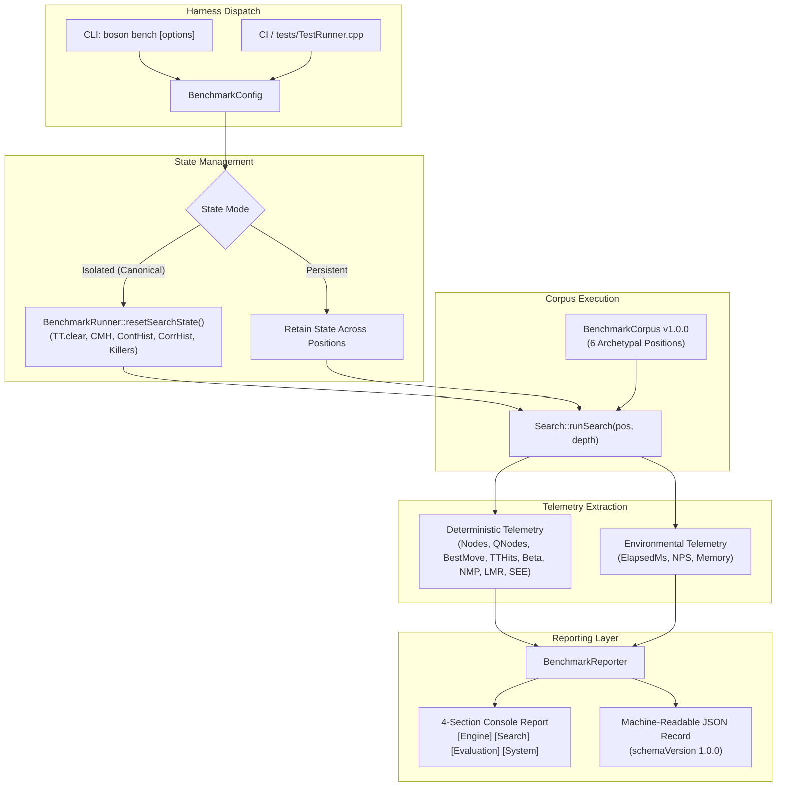
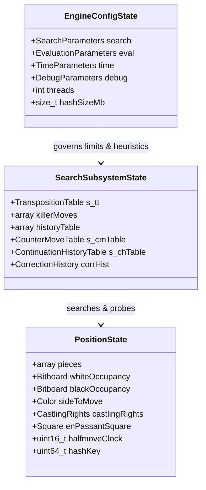

# Deterministic Benchmark Harness — Subsystem Architecture & Verification Specification

## 1. Subsystem Purpose & Benchmarking Philosophy

Performance optimization in chess engines must navigate a fundamental tension: hardware-dependent wall-clock execution speed (nodes per second) versus algorithmic efficiency (search tree pruning, move ordering quality, and heuristic accuracy). Relying exclusively on wall-clock NPS in continuous integration produces flaky regressions caused by CPU frequency scaling, thermal throttling, operating system context switching, and shared CI hyperthreading.

Milestone Ω Module Ω.4 establishes Boson's **Deterministic Benchmark Harness** (`BenchmarkRunner`, `BenchmarkCorpus`, `BenchmarkReporter`, and `BenchmarkTypes`). The harness decouples deterministic, bit-for-bit reproducible search telemetry from non-deterministic environmental metrics, ensuring that every algorithmic refactoring or search heuristic enhancement is mathematically measurable and verifiable across platforms.



---

## 2. Tripartite State Model

A rigorous benchmark harness must explicitly isolate and manage three distinct tiers of engine state:



1. **Engine Configuration State (`EngineParameters`)**:
   Global heuristic coefficients, tuning weights, LMR constants, NMP reduction depths, and thread counts. The benchmark runner captures this state via `EngineInfo::serializeConfigSnapshot()` into the benchmark run record and guarantees **zero mutation** upon completion.
2. **Search Subsystem State (`TranspositionTable`, Heuristic Tables)**:
   Transposition table clusters, killer move slots, main history tables, counter-move history (`CMH`), continuation history (`ContHist`), and correction history (`CorrHist`). In **Isolated mode** (`BenchmarkStateMode::Isolated`), this state is completely evicted prior to evaluating each position, guaranteeing independent position profiling. In **Persistent mode** (`BenchmarkStateMode::Persistent`), this state is retained across sequential positions to simulate real-game cumulative hash and history warming.
3. **Position State (`Position`)**:
   Pure board representation containing bitboards, castling rights, en-passant square, halfmove counter, and 64-bit Zobrist key. Position states are parsed directly from immutable FEN definitions within `BenchmarkCorpus`.

---

## 3. Deterministic vs. Environmental Telemetry

Telemetry is strictly divided into two orthogonal categories:

### Deterministic Metrics (CI-Validated & Bit-Exact)
These values are purely algorithmic. Under identical engine binaries and identical search depths, they evaluate to bit-for-bit identical integers regardless of CPU speed, operating system, or background CPU load:

| Metric | Field | Description |
|---|---|---|
| **Total Nodes** | `totalNodes` | Sum of internal negamax nodes and quiescence nodes |
| **Quiescence Nodes** | `totalQNodes` | Total nodes explored within selective capture/check resolution |
| **Completed Depth** | `completedDepth` | Highest iterative deepening iteration completed |
| **Score (cp)** | `scoreCp` | Centipawn score returned at root |
| **Best Move** | `bestMoveUci` | Principal variation root move in UCI notation |
| **PV String** | `pvString` | Complete sequence of moves representing the principal line |
| **TT Hits** | `ttHits` | Successful probes into the Transposition Table |
| **TT Cutoffs** | `ttCutoffs` | Transposition Table lookahead beta cutoffs |
| **Beta Cutoffs** | `betaCutoffs` | Total fail-high events triggering early sub-tree cutoffs |
| **NMP Attempts** | `nmpAttempts` | Total null-move pruning invocations |
| **NMP Cutoffs** | `nmpCutoffs` | Pruned branches confirmed via null-move beta cutoff |
| **LMR Reductions** | `lmrReductions` | Late Move Reductions applied to quiet non-tactical moves |
| **LMR Researches** | `lmrResearches` | Re-searches required when reduced moves failed high |
| **SEE Invocations** | `seeCalls` | Static Exchange Evaluations computed during move ordering |

### Environmental Metrics (Hardware & Host-Dependent)
These values capture physical execution dynamics on the executing machine:

| Metric | Field | Description |
|---|---|---|
| **Elapsed Time** | `elapsedMilliseconds` | Wall-clock execution duration measured via `std::chrono::high_resolution_clock` |
| **Throughput (NPS)** | `nodesPerSecond` | True engine throughput: `(totalNodes * 1000) / elapsedMilliseconds` |
| **Memory Allocated** | `memoryAllocatedMb` | Active Transposition Table memory allocation |

---

## 4. Acceptance Gates (Ω.4-A through Ω.4-F)

The deterministic benchmark harness is governed by six rigorous verification gates enforced in `tests/TestRunner.cpp` (Suite #20):

### Gate Ω.4-A: Determinism Verification Across Passes
- **Directive**: Execute the complete 6-position benchmark corpus across two distinct, back-to-back runs (`run1` and `run2`) in single-threaded Isolated mode.
- **Acceptance Condition**:
  - `run1.aggregate.totalNodes == run2.aggregate.totalNodes` (bit-for-bit equality).
  - `pos1[i].deterministic == pos2[i].deterministic` for all $i \in [0, 5]$.
  - Identical root best moves, completed depths, scores, TT hits, beta cutoffs, NMP events, and LMR reductions.

### Gate Ω.4-B: State Isolation & TT Eviction Verification
- **Directive**: Verify that state isolation completely clears residual search heuristics and that persistent mode exploits warm search state.
- **Acceptance Condition**:
  - In `Isolated` mode: Running position B directly yields identical node count and best move as running position B immediately after position A.
  - In `Persistent` mode: Running position B after position A exhibits altered node count and elevated TT hits, proving warm table retention is operational.

### Gate Ω.4-C: Production Neutrality & Zero Side-Effects
- **Directive**: Confirm that benchmark execution causes zero mutation to production engine configuration or search state.
- **Acceptance Condition**: `EngineParameters` before benchmark execution bit-for-bit equals `EngineParameters` after execution.

### Gate Ω.4-D: Canonical Corpus Coverage
- **Directive**: Ensure the canonical corpus contains 6 curated archetypes spanning initial layout, tactical complexity, closed positional maneuvering, simplified endgame conversion, and king check evasion stress.
- **Acceptance Condition**: Corpus size is exactly 6 positions with version `"1.0.0"`.

### Gate Ω.4-E: JSON Schema & Round-Trip Parity
- **Directive**: Serialize benchmark run records into structured JSON and verify schema compliance and round-trip parsing.
- **Acceptance Condition**:
  - Conforms to Schema v1.0.0 (`schemaVersion`, `corpusVersion`, `engineName`, `positions`, `aggregate`).
  - Aggregate node count equals the arithmetic sum of individual position nodes.
  - Fast round-trip parser validates JSON output without truncation or numerical loss.

### Gate Ω.4-F: CLI Dispatch & Interactive Usability
- **Directive**: Provide a user-facing command `boson bench` routing from `engine/src/main.cpp`.
- **Acceptance Condition**: Accepts `--depth`, `--hash`, `--mode`, and `--json` CLI arguments and renders clean 4-tier terminal tables.

---

## 5. Canonical Benchmark Corpus (v1.0.0)

The canonical benchmark corpus is versioned at `1.0.0` and defined in `BenchmarkCorpus.cpp`:

| # | ID | Category | Target Depth | FEN | Archetype / Purpose |
|---|---|---|:---:|---|---|
| 1 | `startpos` | Standard | 10 | `rnbqkbnr/pppppppp/8/8/8/8/PPPPPPPP/RNBQKBNR w KQkq - 0 1` | Standard initial game opening; baseline branching factor |
| 2 | `kiwipete` | Standard | 8 | `r3k2r/p1ppqpb1/bn2pnp1/3PN3/1p2P3/2N2Q1p/PPPBBPPP/R3K2R w KQkq - 0 1` | Dense tactical branching; heavy castling & pin resolution |
| 3 | `tactical_wac001` | Tactical | 10 | `2rr3k/pp3pp1/1nnqbN1p/3pN3/2pP4/2P3Q1/PPB4P/R4RK1 w - - 0 1` | Tactical sacrifice; deep tactical line discovery (`Qg6!`) |
| 4 | `positional_closed` | Positional | 10 | `r1bq1rk1/pp2bppp/2n1pn2/2pp4/2PP4/2N1PN2/PP2BPPP/R1BQ1RK1 w - - 0 1` | Quiet positional tension; piece coordination & pawn structure |
| 5 | `endgame_kpk` | Endgame | 12 | `8/8/8/4k3/8/8/4P3/4K3 w - - 0 1` | Basic pawn endgame; deep king-and-pawn calculation |
| 6 | `search_stress_evasions`| SearchStress | 9 | `rnbqk1nr/pppp1ppp/8/4p3/1b1P4/5N2/PPP1PPPP/RNBQKB1R w KQkq - 1 3` | In-check evasion search; legal move filtering under check |

---

## 6. CLI Usage & Reporting Interface

### Command-Line Usage

```bash
# Run canonical single-threaded isolated benchmark at default depths
boson bench

# Run fixed-depth benchmark across all corpus positions
boson bench --depth 9

# Run with custom hash table allocation (e.g. 64 MB)
boson bench --depth 8 --hash 64

# Run in persistent state mode (warm TT across sequential positions)
boson bench --depth 7 --mode persistent

# Export machine-readable telemetry to JSON file
boson bench --depth 8 --json benchmark_results.json
```

### Reporter Architecture

The console reporter displays a standardized 4-tier diagnostic table:

```text
================================================================================
                    BOSON CHESS ENGINE BENCHMARK REPORT
================================================================================
[Engine Architecture & Environment]
  Engine:         Boson v0.8.0-dev
  Compiler:       MSVC 1951
  Architecture:   x64 | Instruction Sets: AVX2, BMI2, POPCNT
  Configuration:  Single-Threaded (threads=1), Hash: 16 MB, Mode: Isolated
  Corpus:         Canonical Benchmark Corpus v1.0.0 (6 positions)

--------------------------------------------------------------------------------
[Position Breakdown]
Pos ID               Depth   BestMove    Score (cp)       Nodes      QNodes     Time (ms)         NPS
--------------------------------------------------------------------------------
startpos                10       e2e4           +28      114280       31204           102     1120392
kiwipete                 8       d5e7          +182      458920      124110           395     1161822
...
--------------------------------------------------------------------------------
[Search & Pruning Diagnostics]
  Total Nodes:       1,842,100  | Quiescence Nodes:    512,300 (27.8%)
  Transposition TT:    412,000 hits
  Beta Cutoffs:        184,200 cutoffs
  Null Move Pruning:    28,100 attempts | 22,400 cutoffs (79.7%)
  Late Move Reduct.:    64,200 reduced  |  4,100 re-searches (6.4%)

[System Performance & Throughput]
  Total Elapsed:     1,580 ms
  Effective NPS:     1,165,886 nodes/second
================================================================================
```
