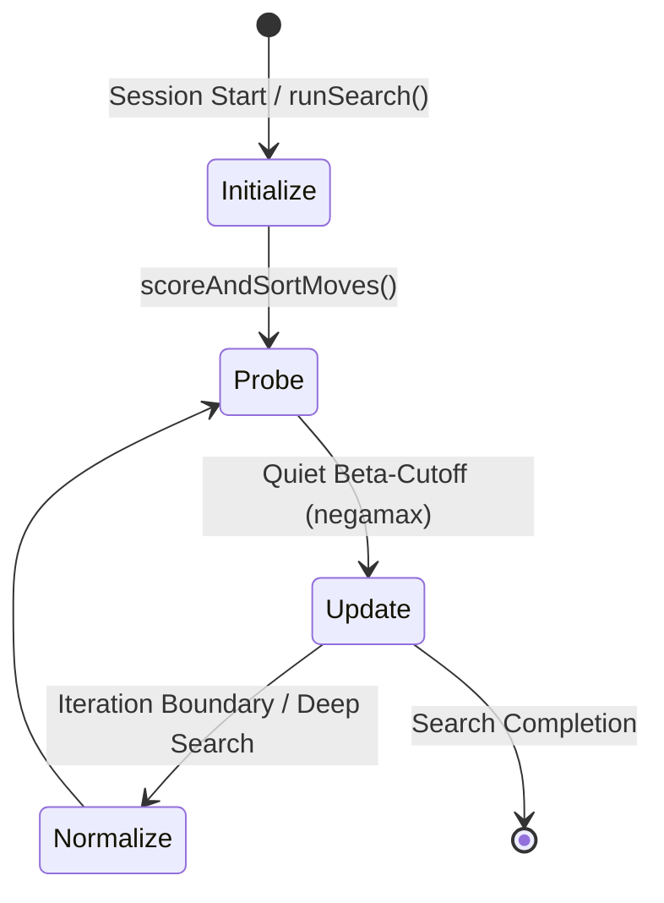

# Continuation History — Multi-Ply Contextual Move Ordering

## 1. Architectural Overview & Heuristic Hierarchy

In modern alpha-beta search architectures, move ordering quality dictates the effective branching factor. While standard heuristics provide valuable approximations, they suffer from inherent contextual blindness:

* **Global (Butterfly) History:** Aggregates quiet move success across the entire search tree indexed solely by `[piece][toSquare]`. It captures general piece activity but lacks any situational context regarding what occurred on the preceding turns.
* **Counter-Move History (CMH):** Maps a direct 1-ply refutation indexed by `[prevFrom][prevTo]` (or `[prevPiece][prevTo]`). It stores the single best reply that refuted the opponent's previous move, acting as a direct lookup table.
* **Continuation History (Conthist):** Tracks multi-ply contextual correlations across successive turns. Instead of storing a single move, Continuation History maintains a statistical score evaluating how effective moving a piece `P` to target square `currTo` is as a direct follow-up to the opponent's previous move ending on `prevTo`.

### Comparative Taxonomy

| Heuristic | Memory Footprint | Context Horizon | Metric Stored | Primary Strength |
| :--- | :--- | :--- | :--- | :--- |
| **Butterfly History** | $12 \times 64 \times 4\text{ B} = 3\text{ KB}$ | 0-ply (Global) | Cumulative cutoff score | Universal piece activity baseline |
| **Counter-Move (CMH)** | $64 \times 64 \times 2\text{ B} = 8\text{ KB}$ | 1-ply (`prevMove`) | Discrete refutation `Move` | Instant single-move refutation |
| **Continuation History** | $12 \times 64 \times 64 \times 4\text{ B} = 192\text{ KB}$ | 1-ply / 2-ply contextual | Bounded statistical score | Nuanced contextual candidate ranking |

---

## 2. Memory Layout & Cache-Conscious Indexing

`ContinuationHistoryTable` is structured as a contiguous, three-dimensional array:

$$\text{Table}[12][64][64] \implies 12 \times 64 \times 64 \times 4\text{ bytes} = 196,608\text{ bytes (192 KB)}$$

### Indexing Dimensions:
1. **Piece ($P \in [0, 11]$):** Attacking / moving piece type and color.
2. **Previous Target Square ($\text{prevTo} \in [0, 63]$):** Destination square of the opponent's prior move.
3. **Current Target Square ($\text{currTo} \in [0, 63]$):** Destination square of candidate move.

By organizing the innermost dimension around `currTo`, sequential move iterations for the same moving piece and preceding context exhibit spatial locality during move scoring sweeps. The 192 KB footprint fits comfortably inside modern CPU L2 data cache (typically 512 KB to 1 MB per core), ensuring zero memory-bus contention.

---

## 3. Unified 4-Stage Lifecycle Contract

The Continuation History table strictly follows the Chief Architect's four-step lifecycle:



### Stage 1: `initialize()`
* **Invocation:** Called unconditionally at session boundaries and at the inception of `Search::runSearch()`.
* **Action:** Clears all 49,152 score cells to zero (`fill(0)`), guaranteeing zero inter-search bias.

### Stage 2: `probe(Piece p, Square prevTo, Square currTo)`
* **Invocation:** Read-only access invoked by `MoveOrderer::scoreAndSortMoves()`.
* **Action:** Queries `m_table[p][prevTo][currTo]`. If any index is invalid (`Piece::None` or `Square::None`), it returns `0`.

### Stage 3: `update(Piece p, Square prevTo, Square currTo, int bonus)`
* **Invocation:** Executed inside `Search::negamax()` when a quiet move triggers a beta-cutoff ($\alpha \ge \beta$).
* **Gravity Decay Formula:**
  $$\text{bonus} = \text{clamp}(\text{depth}^2, -16384, 16384)$$
  $$\text{score} \leftarrow \text{score} + \text{bonus} - \frac{\text{score} \times |\text{bonus}|}{16384}$$
  $$\text{score} \leftarrow \text{clamp}(\text{score}, -16384, 16384)$$
  This saturating gravity formula ensures that scores smoothly asymptote toward $\pm 16384$, completely preventing integer overflow without requiring frequent full-table normalization sweeps.

### Stage 4: `normalize()` / `age()`
* **Invocation:** Triggered at search boundaries or during global history resets.
* **Action:** Halves all entries ($\text{score} \leftarrow \text{score} / 2$), preserving relative historical preference while aging out stale tree trajectories.

---

## 4. Move Ordering Stratification & LMR Interaction

Continuation History occupies a dedicated, prioritized tier directly above Counter-Move History and Butterfly History:

```
[ Tier 1 ] Transposition Table Move   : 100,000
[ Tier 2 ] Winning Captures (SEE >= 0):  50,000 + MVV_LVA
[ Tier 3 ] Pawn Promotions            :  40,000
[ Tier 4 ] Killer Move 1              :  32,000
[ Tier 5 ] Killer Move 2              :  30,000
[ Tier 6 ] Continuation History (High):  26,000 to 29,500
[ Tier 7 ] Counter-Move History (CMH) :  24,000
[ Tier 8 ] Butterfly History (Global) :       0 to 20,000
[ Tier 9 ] Quiet Move Baseline        :       0
[ Tier 10] Losing Captures (SEE < 0)  : -20,000 + SEE
```

### Architectural Rationale:
1. **Continuation > Counter-Move:** A move that exhibits strong multi-ply statistical refutation history across the position represents a broader contextual correlation than a single static countermove.
2. **Negative Continuation Dampening:** When a quiet move has negative continuation history ($\text{conthistScore} < 0$), it gently penalizes the global butterfly history score (`hist + conthistScore / 16`), suppressing moves that generally look active but specifically fail in the current context.
3. **LMR Synergy:** Moves receiving high Continuation History scores are prioritized into the first three quiet candidate slots ($m < 4$), automatically exempting them from Late Move Reductions ($R = 0$) and accelerating alpha-beta cutoffs.
