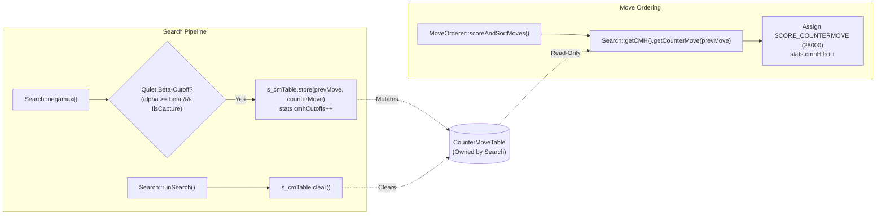

# Counter-Move History (CMH) Architecture & Search Heuristics Map

This document formalizes the architectural specifications, data structures, update rules, and consumer boundaries governing Boson's Counter-Move History (Module 6.8).

---

## 1. Theoretical Foundation

Classical move ordering heuristics fall into two broad paradigms:
1. **Context-Free Heuristics**:
   - **Static Exchange Evaluation (SEE)**: Evaluates material consequences of immediate tactical trades.
   - **Butterfly History Table**: Tracks long-term success of moves $(piece, toSq)$ aggregated across all plies and unrelated positions.
2. **Local Ply Heuristics**:
   - **Killer Moves**: Remembers recent quiet refutations at the current tree depth (`ply`), capturing local defensive resources.

**Counter-Move History (CMH)** bridges the gap between context-free global statistics and ply-local memory by tracking **contextual refutations**:
$$\text{PreviousMove } (from_{\text{prev}}, to_{\text{prev}}) \longrightarrow \text{RefutingCounterMove } (from_{\text{reply}}, to_{\text{reply}})$$

When an opponent plays a specific move (such as pushing a central pawn or deploying a knight), the set of effective refutations is strongly correlated with that opponent move regardless of the specific global board configuration. By associating the refuting move directly with the opponent's previous move, CMH identifies high-probability cutoffs much earlier in move ordering than unindexed quiet moves.

---

## 2. Decoupled Architecture & Table Ownership

To guarantee thread safety, deterministic search, and clean separation of concerns, Boson enforces strict boundaries between heuristic mutation and consumption:



### Invariants:
1. **Sole Mutation Owner**: `Search::negamax()` exclusively mutates `s_cmTable` upon a quiet beta-cutoff (`!isCaptureMove`) when `prevMove` is valid.
2. **Read-Only Consumer**: `MoveOrderer` reads `Search::getCMH()` as a `const` reference. Move ordering never modifies the table during sorting.
3. **Search Boundary Hygiene**: The entire table is zero-initialized at the start of `Search::runSearch()` (or UCI `ucinewgame`), preventing stale heuristics across distinct root positions.

---

## 3. Table Layout & Cache Efficiency

The Counter-Move Table (`CounterMoveTable`, `engine/include/search/CounterMoveTable.hpp`) employs a dense, statically sized contiguous 2D array:

```cpp
class CounterMoveTable {
    // Primary index: [prevFrom][prevTo]
    std::array<std::array<Move, 64>, 64> m_table{};

    // Secondary index: [prevPiece][prevTo]
    std::array<std::array<Move, 64>, 12> m_pieceTable{};
};
```

### Memory Footprint:
- **Primary Table**: $64 \times 64 \times \text{sizeof(Move)} = 4096 \times 2 \text{ bytes} = 8 \text{ KB}$.
- **Secondary Table**: $12 \times 64 \times \text{sizeof(Move)} = 768 \times 2 \text{ bytes} = 1.5 \text{ KB}$.
- **Total Footprint**: $9.5 \text{ KB}$.

Because modern CPU L1 data caches are $32 \text{ KB}$ to $48 \text{ KB}$ per core, the entire Counter-Move Table resides comfortably within L1, guaranteeing single-cycle lookup latency with zero cache thrashing.

---

## 4. Move Ordering Stratification

Inside `MoveOrderer::scoreAndSortMoves()`, candidate moves are evaluated against strict hierarchical score tiers:

| Tier | Heuristic Category | Score Constant | Description |
| :---: | :--- | :---: | :--- |
| **1** | Transposition Table (TT Move) | `100,000` | Exact or bound-exceeding move from earlier depth. |
| **2** | Good Captures (SEE $\ge 0$) | `50,000 + MVV_LVA` | Material winning or neutral exchanges. |
| **3** | Promotions | `40,000` | Pawn promotions to Queen or minor pieces. |
| **4** | Primary Killer Move (`killer[ply][0]`) | `30,000` | First quiet refutation at current tree ply. |
| **5** | Secondary Killer Move (`killer[ply][1]`) | `29,000` | Second quiet refutation at current tree ply. |
| **6** | **Counter-Move (CMH)** | **`28,000`** | **Contextual refutation to opponent's previous move.** |
| **7** | Continuation & Butterfly History | `0 to 20,000` | Correlation history combined with global butterfly stats. |
| **8** | Unordered Quiet Moves | `0` | Default baseline for untested quiet candidates. |
| **9** | Losing Captures (SEE $< 0$) | `-20,000 + SEE` | Tactically losing exchanges deferred to sub-quiet slots. |

CMH occupies Tier 6: placed directly beneath Killer moves (which reflect immediate ply refutations) and strictly above global Butterfly History (bounded at $20,000$).

---

## 5. Synergy with LMR and Search Heuristics

CMH acts as an essential catalyst across Boson's lookahead framework:
1. **LMR Safety**: Late Move Reductions (Module 6.7) reduce nominal search depth on moves at index $\ge 4$. By prioritizing counter-moves into the top 3 slots, CMH ensures that contextual refutations are searched at full nominal depth and never inadvertently reduced.
2. **Aspiration Window Convergence**: Faster beta-cutoffs reduce tree width and fail-high/fail-low volatility, accelerating aspiration window resolution.
3. **Continuation History Layering**: Counter-moves provide the 1-ply base for multi-ply Continuation History (Module 6.9), which tracks $(piece, prevMove, replyMove)$ correlations across 2-ply and 4-ply horizons.
