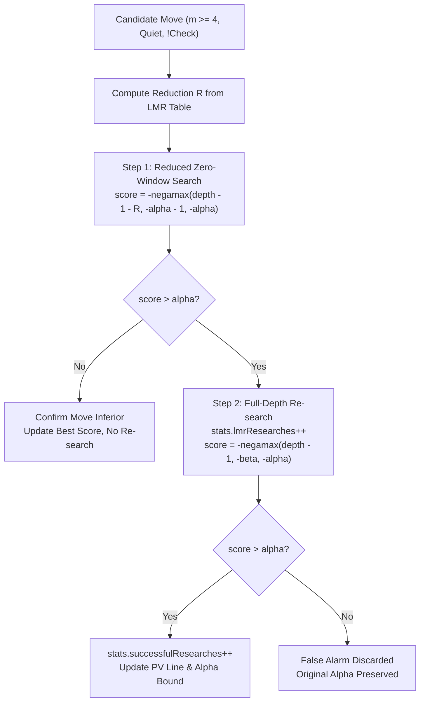

# Late Move Reductions (LMR) Architecture & Re-search Safeguards

This document formalizes the architectural specifications, mathematical formulation, eligibility invariants, and re-search safeguards governing Boson's Late Move Reductions (Module 6.7).

---

## 1. Theoretical Foundation

In an optimal Alpha-Beta search tree ordered by move quality, the first candidate move searched at any PV or Cut node is disproportionately likely to cause a beta-cutoff (fail-high) or establish the true minimax bound. Under the null-window scout paradigm, moves searched after the principal candidates have an exponentially decreasing probability of improving alpha.

**Late Move Reductions (LMR)** is a speculative soft-pruning technique that searches late quiet moves to a shallower nominal depth $d' = d - 1 - R$ with a minimal zero-window:
$$[\alpha_{\text{scout}}, \beta_{\text{scout}}] = [-\alpha - 1, -\alpha]$$

Unlike hard pruning heuristics (such as Null Move Pruning or Reverse Futures Pruning) which permanently discard subtrees, LMR is **non-destructive**: if a reduced scout search demonstrates unexpected strength by scoring $> \alpha$, the reduction assumption is invalidated and the move is immediately re-searched at full unreduced depth with the complete search window.

---

## 2. Interplay with Move Ordering

The safety and efficiency of LMR are strictly bound to the quality of Boson's `MoveOrderer`:
1. **Tier 1 (Hash Move)**: Move identified by previous search iterations or Transposition Table hits.
2. **Tier 2 (Good Captures / Promotions)**: MVV-LVA and SEE positive captures.
3. **Tier 3 (Killer Moves)**: High-frequency quiet refutations at the current ply.
4. **Tier 4 (Counter-Moves)**: Domain-specific refutations indexed by previous move.
5. **Tier 5 (Continuation History)**: Multi-ply quiet correlation scores.
6. **Tier 6 (History Table)**: Long-term butterfly quiet heuristics.
7. **Tier 7 (Losing Captures / Underpromotions)**: Negative SEE exchanges.

Because high-quality moves are concentrated in the earliest move slots (indices $0, 1, 2$), quiet moves appearing at move index $\ge 3$ (count $\ge 4$) have already failed heuristic prioritization. Reducing these moves accelerates search throughput by $200\% \text{ to } 500\%$ without material loss of tactical acuity.

---

## 3. Centralized Reduction Policy & Formula

All reduction calculations are centralized in `Boson::LMRPolicy` (`engine/include/search/LMRPolicy.hpp`), precomputed at engine initialization into a 2D lookup table:

```cpp
double reduction = BASE_REDUCTION + (std::log(depth) * std::log(moveCount) / LOG_DIVISOR);
s_reductionTable[depth][moveCount] = std::min(depth - 1, static_cast<int>(reduction));
```

### Configuration Parameters
- `BASE_REDUCTION = 0.5`: Offset ensuring gradual scaling.
- `LOG_DIVISOR = 1.95`: Logarithmic divisor governing asymptotic depth degradation.
- `MIN_DEPTH = 3`: Minimum remaining depth required before reduction is permitted.
- `MIN_MOVE_COUNT = 4`: Minimum 1-based move count ($m \ge 4$, corresponding to 0-based move index $\ge 3$).

### Table Properties
1. **Monotonicity**: $R(d+1, m) \ge R(d, m)$ and $R(d, m+1) \ge R(d, m)$ for all valid domains.
2. **Horizon Safety**: $R(d, m) \le d - 1$, preventing negative or zero remaining depth.
3. **Zero Early Reductions**: $R(d, m) = 0$ for all $d < 3$ or $m < 4$.

---

## 4. Reduction Eligibility Rules

Inside `Search::negamax()`, a candidate move must satisfy seven strict eligibility gates before reduction is applied:

| Gate | Condition | Rationale |
| :--- | :--- | :--- |
| **Depth Gate** | `searchedDepth >= 3` | Shallow subtrees lack headroom for depth reduction. |
| **Move Index Gate** | `movesSearched >= 4` | Protects the top 3 heuristic candidates from depth truncation. |
| **Hash PV Gate** | `!isPvMove` | TT best move must always be searched at full nominal depth. |
| **In-Check Gate** | `!inCheck` | Evasions must resolve all check threats at full depth. |
| **Tactical Gate** | `!isCaptureMove && !isPromotionMove` | Material transformations and promotions cannot be reduced. |
| **Check Delivery Gate** | `!givesCheck` | Direct checks against opponent king may force mating nets. |
| **King Zone Gate** | `!inEnemyKingZone` | Attacks targeting squares adjacent to enemy king are tactically critical. |

### Heuristic Adjustments
- **Killer Move Discount**: Proven killer moves reduce $R$ by 1 ($R' = \max(0, R - 1)$).
- **History Discount**: Moves with history table score $> 4000$ reduce $R$ by 1 ($R' = \max(0, R - 1)$).

---

## 5. Full-Depth Re-search Protocol

When $R > 0$, the search pipeline executes the two-step verification protocol:



### PV Line Synchronization
During Step 2, `childPv` is passed directly by reference to the full-depth `negamax` invocation. If the re-search confirms `score > alpha`, `childPv` is prepended with the candidate move and copied into `pv`, guaranteeing triangular PV integrity.

---

## 6. Telemetry & Analytics

The `SearchStatistics` subsystem tracks LMR efficiency across all search iterations:
- `lmrAttempts`: Total times a quiet move met eligibility criteria and underwent reduced search.
- `lmrReducedNodes`: Total search nodes visited under a reduced depth budget.
- `lmrResearches`: Number of reduced searches that failed high ($> \alpha$) and triggered Step 2 full-depth re-searches.
- `successfulResearches`: Number of full-depth re-searches that confirmed the move exceeds alpha, representing verified PV overturns.

Efficiency metrics reported:
$$\text{Re-search Rate} = \frac{\text{lmrResearches}}{\text{lmrAttempts}} \times 100\%$$
$$\text{Overturn Efficiency} = \frac{\text{successfulResearches}}{\text{lmrResearches}} \times 100\%$$

---

## 7. Future Extensions

1. **Improving Flag Dynamic Scaling**: Increase reduction by 1 when static evaluation is not improving over previous ply.
2. **Negative History Penalization**: Increase reduction by 1 when history score is deeply negative ($< -2000$).
3. **Capture Reductions (SEE < 0)**: Selectively reduce bad captures with severe negative Static Exchange Evaluation.
