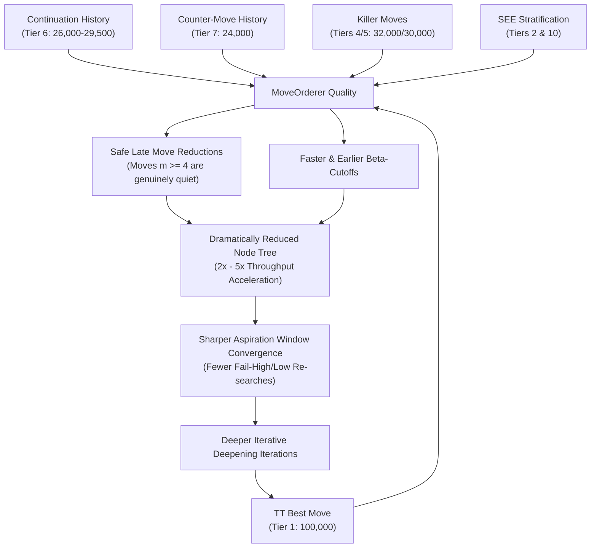

# Boson — Search Heuristics Architecture Map & Interaction Ecosystem

This document establishes the interaction rules, subsystem ownership boundaries, and core design philosophies governing Boson's lookahead optimization ecosystem.

---

## 1. Systemic Interaction Map & Ownership Matrix

Boson coordinates nine specialized heuristic subsystems to prune, reduce, and order search paths with maximum minimax efficiency.

| Heuristic Subsystem | Owner Component | Consumer Component | Mutation Event | Pruning / Ordering Effect | Interaction Dependency |
| :--- | :--- | :--- | :--- | :--- | :--- |
| **Transposition Table (TT)** | `Search` | `Search` / `MoveOrderer` | Exact, LowerBound, or UpperBound node resolution | Instant subtree cutoff (Exact/Bound hit); Tier 1 move ordering priority (`100,000`) | Seeds iterative deepening best moves and root PV locks. |
| **Aspiration Windows** | `Search` (Driver) | `Search::negamax` | Window bounds $(\alpha, \beta)$ widened upon fail-high / fail-low | Restricts search space to narrow window $[s - \Delta, s + \Delta]$ | Relies on score stability from iterative deepening and TT hits. |
| **Quiescence Search** | `Search` | Leaf evaluation | Dynamic capture / check evasion exploration | Extends search at depth $\le 0$ with stand-pat cutoffs | Eliminates the horizon effect on tactical liquidation chains. |
| **Static Exchange Eval (SEE)** | `SEE` Subsystem | `MoveOrderer` / `quiescence` | None (pure stateless geometry query) | Stratifies captures (Tier 2 vs. Tier 10); prunes losing captures in Q-search | Protects LMR and Quiescence from exploring tactically losing traps. |
| **Null Move Pruning (NMP)** | `Search` | `Search::negamax` | Null-move probe failure / beta-cutoff | Cuts subtrees early by skipping side-to-move turn ($R = 2$) | Gated by `!inCheck`, non-pawn material, and $d \ge 3$ to prevent zugzwang. |
| **Late Move Reductions (LMR)** | `Alpha-Beta` | `Search::negamax` | Scout zero-window fail-high triggers full re-search | Depth reduction ($R \ge 1$) on quiet moves with index $\ge 4$ | Strictly dependent on MoveOrderer accuracy to avoid reducing tactics. |
| **Killer Moves** | `Search` | `MoveOrderer` | Quiet beta-cutoff at tree `ply` | Assigns Tier 4 (`32,000`) and Tier 5 (`30,000`) priority | Tracks immediate local refutations across fraternal subtrees. |
| **Continuation History** | `Search` | `MoveOrderer` | Quiet beta-cutoff following `prevMove` and moving piece | Assigns Tier 6 (`26,000 to 29,500`) priority | Multi-ply contextual move ordering; suppresses poor replies via malus. |
| **Counter-Move History (CMH)** | `Search` | `MoveOrderer` | Quiet beta-cutoff following `prevMove` | Assigns Tier 7 (`24,000`) priority | Connects opponent moves to direct quiet refutations across positions. |
| **Butterfly History (Global)** | `Search` | `MoveOrderer` / `LMR` | Quiet beta-cutoffs update saturating gravity tables | Assigns Tier 8 (`0 to 20,000`) priority | Long-term global statistical ranking and correlation memory. |

---

## 2. Heuristic Cascading Effects

The heuristics do not operate in isolation; rather, they form a tightly coupled positive feedback cycle:

### Key Synergies:
1. **Continuation & CMH $\longrightarrow$ LMR Safety**:
   Because LMR only applies to moves searched at index $\ge 4$, prioritizing proven continuation and counter-moves into Tiers 6 and 7 guarantees that contextual refutations are explored in slots 1, 2, or 3. They are therefore searched at full depth without risk of erroneous reduction.
2. **Move Ordering $\longrightarrow$ Aspiration Convergence**:
   When move ordering places the refutation first, Alpha-Beta traverses Cut-nodes in a single branch ($O(1)$ child exploration). This maintains score stability across successive depths, preventing aspiration window fail-high and fail-low blowups.
3. **SEE $\longrightarrow$ Quiescence Stability**:
   SEE filters out losing captures ($SEE < 0$), preventing quiescence search from chasing blundering sacrificial cascades, which preserves time allocation for nominal iterative deepening.

---

## 3. Boundary & Thread Safety Guidelines

1. **Read-Only Invariance in Consumers**: `MoveOrderer`, `SEE`, and `Evaluator` must never modify heuristic state tables during search.
2. **Deterministic Reset Contract**: All heuristic tables (`TT`, `Killers`, `CMH`, `ContHist`, `History`) are cleared or aged symmetrically at session boundaries (`initSearch`, `ucinewgame`).
3. **Bounded Memory Footprint**: Heuristic tables are sized for CPU L1/L2 cache residency ($CMH = 9.5 \text{ KB}$, $ContHist = 192 \text{ KB}$, $History = 3 \text{ KB}$), preventing memory pressure and bus saturation.
