# State Transition & Search Integrity — Architecture & Fuzzing Specification

## 1. Architectural Purpose & Verification Philosophy

In a high-performance chess engine, board state representation and move execution (`makeMove` / `undoMove`) form the foundational bedrock. Any subtle state corruption—such as a desynchronized Zobrist hash key, an orphaned en-passant square, an improperly restored castling rights bitmask, or an evaluation counter leak during search lookahead—cascades exponentially into search instability, transposition table poisoning, and illegal move generation.

Milestone Ω Module Ω.3 implements a rigorous, property-based **State Transition & Search Integrity Verification Framework** (`tests/integrity/PositionFingerprint.hpp`, `tests/integrity/IntegritySuite.hpp`, `tests/integrity/IntegritySuite.cpp`).

```mermaid
flowchart TD
    subgraph Layer A: 1-Ply Exhaustive
        A1[Corpus Position P] --> A2[Generate All Legal Moves]
        A2 --> A3[makeMove m]
        A3 --> A4[undoMove m]
        A4 --> A5{Fingerprint Match?}
        A5 -- Yes --> A6[Next Move]
        A5 -- No --> A7[Layer A Failure]
    end

    subgraph Layer B: Deep Random Walk Fuzzing
        B1[Corpus Position P0] --> B2[Capture Initial Fingerprint]
        B2 --> B3[10 to 50 Ply Uniform Random Walk]
        B3 --> B4[Stress: Castling, EP, Promotions, Check Evasions]
        B4 --> B5[Unwind Stack via undoMove]
        B5 --> B6{Fingerprint Match?}
        B6 -- Yes --> B7[10,000 Sequences Complete]
        B6 -- No --> B8[Layer B Failure]
    end

    subgraph Layer C: Search Root Invariance
        C1[Corpus Position P] --> C2[Capture Root Fingerprint]
        C2 --> C3[Execute Search::runSearch Depth 6+]
        C3 --> C4[Capture Post-Search Fingerprint]
        C4 --> C5{Bit-Exact Identity?}
        C5 -- Yes --> C6[Zero Leaked State]
        C5 -- No --> C7[Layer C State Leak]
    end
```



---

## 2. Position Fingerprint Specification

The [`PositionFingerprint`](file:///C:/Users/Dell/Desktop/Programming/Project/Boson/tests/integrity/PositionFingerprint.hpp#L19-L34) structure captures an exhaustive, bit-for-bit snapshot of all persistent and volatile state within a `Position`:

```cpp
struct PositionFingerprint {
    std::array<Bitboard, 12> pieces{};
    Bitboard whiteOccupancy{0};
    Bitboard blackOccupancy{0};
    Bitboard totalOccupancy{0};
    Color sideToMove{Color::White};
    CastlingRights castlingRights{CastlingRights::None};
    Square enPassantSquare{Square::None};
    uint16_t halfmoveClock{0};
    uint16_t fullmoveNumber{1};
    Square whiteKingSquare{Square::None};
    Square blackKingSquare{Square::None};
    uint64_t hashKey{0};
};
```

### Bit-Exact Invariance Contract
- **Operator Equality (`==`)**: Evaluates all 12 piece bitboards, occupancy bitboards, side to move, castling rights, en-passant square, halfmove clock, fullmove number, king squares, and 64-bit Zobrist hash key.
- **Differential Diagnostics (`diff()`)**: When two fingerprints disagree, `diff()` isolates the exact bitboard discrepancies, flag offsets, and hexadecimal hash differences to pinpoint state corruption.

---

## 3. Three-Layer Verification Architecture

### Layer A: Exhaustive 1-Ply Round-Trip Invariance
For every legal move $m$ generated across a diverse corpus of 22 benchmark positions:
$$P \xrightarrow{\text{makeMove}(m)} P' \xrightarrow{\text{undoMove}(m)} P'' \implies \text{fingerprint}(P'') \equiv \text{fingerprint}(P)$$

This proves that no move—regardless of type (quiet, double pawn push, kingside/queenside castle, capture, en-passant capture, or promotion)—leaves residual side effects after unwinding.

### Layer B: Deep Random Walk Fuzzing (Monte Carlo Property Testing)
To stress multi-ply state transitions, non-trivial piece interactions, and history-dependent invariants, Layer B executes **10,000 randomized walk sequences** with path lengths between 10 and 50 plies ($N \in [10, 50]$):

1. **Stochastic Path Exploration**: Moves are selected uniformly at random from legal moves at each ply using a deterministic 64-bit XorShift PRNG.
2. **Terminal Edge Handling**: Sequences gracefully terminate if a position reaches checkmate or stalemate, followed by full stack unwinding.
3. **Domain Event Stress Coverage**:
   - **King-Side & Queen-Side Castling**: Verifies rook and king traversal, occupancy updates, and rights revocation.
   - **Rook Captures**: Verifies that capturing an un-moved corner rook revokes the corresponding castling right and correctly restores it upon undo.
   - **En-Passant Dynamics**: Verifies two-square pawn pushes creating EP squares, 1-ply expiration when another move is played, and diagonal EP capture pawn removal.
   - **Promotions (Q, R, B, N)**: Validates pawn replacement, minor/major piece occupancy injection, and correct piece restoration upon unwind.
   - **Check & Double-Check Evasions**: Verifies king-evasion legal move generation, interposition unwinds, and checker bitboard consistency.

### Layer C: Search Root Invariance
Production search lookahead operates on the root `Position` by reference. Deep alpha-beta search with aspiration windows, null-move pruning, late move reductions, and quiescence search makes and undoes hundreds of thousands of candidate paths.

Layer C captures the root fingerprint, executes a full-depth lookahead (`Search::runSearch(pos, 6)`), and asserts that the root position after search completion is **bit-for-bit identical** to the pre-search state, confirming zero search state leaks.

---

## 4. Benchmark Corpus Breakdown

The 22 positions selected for the integrity suite cover the complete operational spectrum:

| # | Identification | Characteristics & Stress Profile |
| :-: | :--- | :--- |
| 1 | `Standard Startpos` | Standard opening symmetry; all castling and double-push options intact. |
| 2 | `KiwiPete` | Benchmark tactical suite; extreme pin, castling, and EP density. |
| 3 | `CPW Position 3` | Asymmetric pawn-and-rook endgame with advanced passers. |
| 4 | `CPW Position 4` | Sharp middlegame featuring multiple queens and promotional tension. |
| 5 | `CPW Position 5` | Underpromotion and discovery tactical pressure. |
| 6 | `CPW Position 6` | Complex multi-piece middlegame pins and central tension. |
| 7 | `Lucena Position` | Rook-and-pawn endgame with bridge-building geometry. |
| 8 | `Philidor Position` | Defensive rook-and-pawn endgame technique. |
| 9 | `Queen Endgame` | Open-board queen maneuverability and perpetual check vectors. |
| 10 | `Pure Pawn Opposition` | King-and-pawn opposition with mutual zugzwang potential. |
| 11 | `EP Discovered Check` | En-passant capture exposing discovered check on the file. |
| 12 | `Castling Rights Edge` | Four unmoved rooks and kings with clear paths. |
| 13 | `Black EP Available` | Black en-passant capture available on rank 3. |
| 14 | `Heavy Liquidation` | Doubled rooks on an open file facing mutual back-rank liquidation. |
| 15 | `Knight Family Fork` | Centralized knight with multi-target fork vectors. |
| 16 | `Wrong-Colored Bishop` | Opposite-color bishop endgame fortress characteristics. |
| 17 | `Rank-7 Skewer` | Absolute skewer along the 7th rank against king and queen. |
| 18 | `WAC.001 Heavy Strike` | Complex multi-piece queen-and-rook mating attack. |
| 19 | `WAC.003 Knight Sacrifice` | Sharp kingside sacrifice with piece tension. |
| 20 | `King Defense in Check` | Single and multi-piece check evasion paths. |
| 21 | `Four Queens Chaos` | Multi-queen diagonal/orthogonal geometry. |
| 22 | `7th Rank Promotion` | Immediate pawn promotion to Q, R, B, and N. |

---

## 5. Quantitative Verification Results

```text
=================================================================
===   MILESTONE OMEGA, MODULE OMEGA.3: STATE INTEGRITY REPORT ===
=================================================================
[Scope & Workload Metrics]
  Positions Tested             : 22
  1-Ply Legal Moves Tested     : 512
  Deep Random Walk Sequences   : 10000
  Total Random Walk Plies      : 294667
  Maximum Sequence Depth       : 50

[Domain Event Stress Coverage]
  King-Side Castles Executed   : 353
  Queen-Side Castles Executed  : 262
  Rook Captures (Rights Revoked): 868
  En-Passant Pushes Created    : 10739
  En-Passant Captures Executed : 195
  Promotions to Queen (Q)      : 597
  Promotions to Rook (R)       : 588
  Promotions to Bishop (B)     : 582
  Promotions to Knight (N)     : 616
  Check Evasions Unwound       : 16414
  Double-Check Evasions Unwound: 23

[Charter Invariant Verification]
  Make/Undo Mismatches         : 0 (target: 0)
  Search State Leaks           : 0 (target: 0)
  Zobrist Hash Mismatches      : 0 (target: 0)
  Castling State Failures      : 0 (target: 0)
  En-Passant State Failures    : 0 (target: 0)
  Promotion State Failures     : 0 (target: 0)
  Check-State Invariant Fails  : 0 (target: 0)
  Crashes / Undefined Behavior : 0 (target: 0)
=================================================================
MODULE OMEGA.3 VERIFICATION RESULT: PASSED
=================================================================
```
