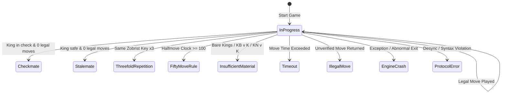
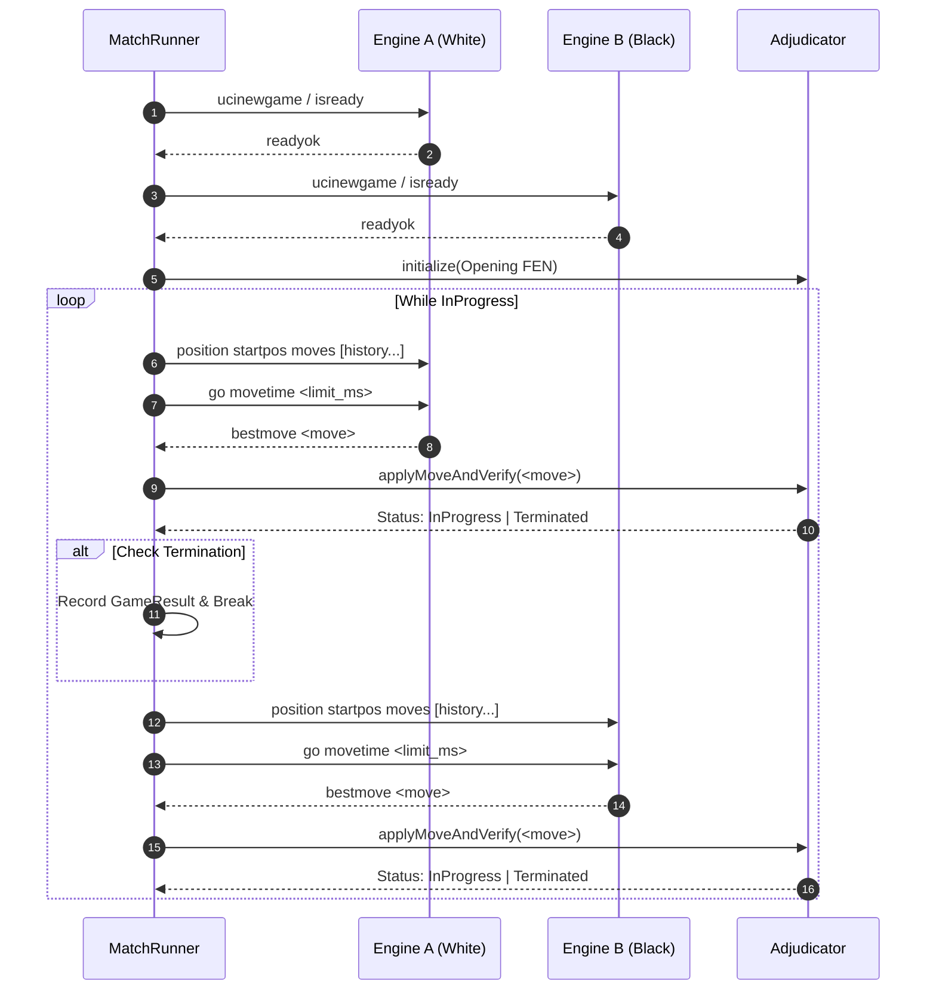

# Strength & Elo Validation Harness - Statistical Architecture & Verification Specification

## 1. Architectural Purpose & Benchmarking Philosophy

Assessing chess engine strength improvements requires rigorous statistical methodology. Small sample matches (e.g., 10–50 games) suffer from severe sampling noise, where a random $\pm 2$ win swing can falsely masquerade as a +50 Elo breakthrough. Furthermore, naive linear Elo approximations break down near extreme scores ($p \to 0$ or $p \to 1$).

Milestone $\Omega$ Module $\Omega$.5 establishes Boson's **Strength & Elo Validation Harness** (`MatchRunner`, `Statistics`, `OpeningBook`, `StrengthReporter`, and `StrengthTypes`). The subsystem adheres to the following core architectural directives:

1. **Protocol-Pure Engine Isolation**: Engines communicate strictly across the Universal Chess Interface (UCI) boundary (`ucinewgame`, `position startpos moves ...`, `go movetime <ms>`, `bestmove <move>`). No internal board state or search state is shared across engine instances.
2. **Wilson-Style Confidence Bounds with Numerical Domain Separation**: Confidence intervals are computed as a **Wilson-style interval applied to the empirical game-score statistic** (not an exact multinomial confidence interval). The system enforces an explicit separation between the raw statistical Wilson interval and the numerical $\varepsilon = \frac{1}{2N}$ domain guard required for the logistic Elo transform.
3. **Sequential Testing (SPRT)**: Wald Sequential Probability Ratio Testing enables rapid hypothesis acceptance ($H_1: \Delta\text{Elo} \ge +10$) or rejection ($H_0: \Delta\text{Elo} \le 0$) with bounded type I/II error rates ($\alpha = 0.05, \beta = 0.05$).
4. **Color-Symmetric Paired Openings**: Games are scheduled in 2-game pairs with reversed colors on identical opening books, neutralizing first-move advantage.
5. **Infrastructure / Protocol Smoke Testing**: Fast 2-game matches (such as Gate $\Omega$.5-A) serve strictly as an **Infrastructure/Protocol Smoke Test** to verify UCI interchange, time/depth controls, and adjudication integrity—they do not constitute engine strength progression claims, which require large-sample SPRT matches.

---

## 2. Mathematical Specification of the Statistical Engine

### 2.1 Empirical Score & Sample Variance

Given $W$ wins, $D$ draws, and $L$ losses across $N = W + D + L$ completed games:

1. **Empirical Score ($p$)**:
   $$p = \frac{W + 0.5 \cdot D}{N}$$

2. **Sample Variance ($\sigma^2$)**:
   $$\sigma^2 = \frac{W(1 - p)^2 + D(0.5 - p)^2 + L(0 - p)^2}{N - 1} \quad (\text{for } N > 1)$$
   For $N \le 1$, $\sigma^2 = 0.0$ to guard against division-by-zero.

3. **Standard Error ($SE$)**:
   $$SE = \sqrt{\frac{\sigma^2}{N}}$$

### 2.2 Analytical Wilson-Style Score Interval

To guarantee non-collapsing, statistically sound intervals in extreme score regimes ($p \to 0$ or $p \to 1$, where naive sample variance collapses to $\sigma^2 = 0$), the score interval is formulated as a **Wilson-style interval applied to the empirical game-score statistic** $p$ (rather than an exact multinomial interval):

For a two-sided 95% confidence level ($z = 1.959963984540054$):
$$\text{denominator} = 1.0 + \frac{z^2}{N}$$
$$\text{center} = \frac{p + \frac{z^2}{2N}}{\text{denominator}}$$
$$\text{halfWidth} = \frac{z \cdot \sqrt{\frac{p(1 - p)}{N} + \frac{z^2}{4N^2}}}{\text{denominator}}$$
$$\text{rawWilsonLower} = \max\left(0.0, \, \text{center} - \text{halfWidth}\right)$$
$$\text{rawWilsonUpper} = \min\left(1.0, \, \text{center} + \text{halfWidth}\right)$$

### 2.3 Numerical Domain Guard for Logistic Transform (Decoupled Epsilon)

The empirical confidence interval (Wilson Score) and the numerical domain guard (`kLogisticEpsilon = 1e-6`) are **separate mathematical concepts**:
1. **Statistical Uncertainty Interval**: The Wilson score interval $[\text{rawWilsonLower}, \text{rawWilsonUpper}]$ directly models the physical observation uncertainty of binomial scoring over sample size $N$. It remains strictly uncorrupted.
2. **Numerical Domain Guard**: The logistic transformation $\Delta\text{Elo}(p) = 400 \cdot \log_{10}\left(\frac{p}{1 - p}\right)$ has asymptotes at $p = 0.0$ ($-\infty$) and $p = 1.0$ ($+\infty$). To evaluate finite logarithms without floating-point exception or NaN, probabilities are clamped to the open interval $(\varepsilon_{\text{logistic}}, 1 - \varepsilon_{\text{logistic}})$.

A naive sample-dependent guard $\varepsilon = \frac{1}{2N}$ artificially corrupts statistical behavior at small sample sizes: when $N = 1$, $\varepsilon = \frac{1}{2(1)} = 0.5$, which collapses the domain guard $[\varepsilon, 1 - \varepsilon]$ to the single point $[0.5, 0.5]$, extinguishing the wide uncertainty interval of a 1-game sample.

To preserve proper uncertainty bounds across all sample sizes, Boson decouples the numerical domain guard from $N$ using a fixed constant:
$$\varepsilon_{\text{logistic}} = 10^{-6} \quad (\texttt{kLogisticEpsilon})$$
$$\text{eloScoreLower} = \text{clamp}\left(\text{rawWilsonLower}, \, \varepsilon_{\text{logistic}}, \, 1.0 - \varepsilon_{\text{logistic}}\right)$$
$$\text{eloScoreUpper} = \text{clamp}\left(\text{rawWilsonUpper}, \, \varepsilon_{\text{logistic}}, \, 1.0 - \varepsilon_{\text{logistic}}\right)$$
$$p_{\text{clamped}} = \text{clamp}\left(p, \, \varepsilon_{\text{logistic}}, \, 1.0 - \varepsilon_{\text{logistic}}\right)$$

This guarantees that:
- For $N = 1$, the wide raw Wilson intervals are preserved under the logistic mapping as $\text{CI}(1\text{W}) = [-233.80, +2400.00]$ and $\text{CI}(1\text{L}) = [-2400.00, +233.80]$, such that $\text{CI}(1\text{W}) = -\text{CI}(1\text{L})$ (interval negation reverses and negates endpoints), accurately reflecting high statistical uncertainty with non-zero width ($> 2600$ Elo).
- For $N = 100$ extreme scores ($100\text{W}/0\text{L}$ or $0\text{W}/100\text{L}$), wide, non-zero width intervals ($1833.80$ Elo) and exact reflection symmetry are preserved without NaN or infinite values.

### 2.4 Non-Linear Logistic Elo Mapping

The Elo rating difference $\Delta\text{Elo}$ and its confidence bounds are computed from the guarded endpoints:
$$\Delta\text{Elo} = 400.0 \cdot \log_{10}\left(\frac{p_{\text{clamped}}}{1 - p_{\text{clamped}}}\right)$$
$$\text{Elo}_{\text{Lower}} = 400.0 \cdot \log_{10}\left(\frac{\text{eloScoreLower}}{1 - \text{eloScoreLower}}\right)$$
$$\text{Elo}_{\text{Upper}} = 400.0 \cdot \log_{10}\left(\frac{\text{eloScoreUpper}}{1 - \text{eloScoreUpper}}\right)$$

All outputs are rigorously verified via `assert(std::isfinite(...))` ensuring zero occurrences of NaN, $+\infty$, or $-\infty$.

### 2.5 Sequential Probability Ratio Test (SPRT)

The harness tests composite hypotheses for engine Elo progression:
- $H_0: \Delta\text{Elo} \le \text{Elo}_0$ (default $0.0 \implies p_0 = 0.5$)
- $H_1: \Delta\text{Elo} \ge \text{Elo}_1$ (default $+10.0 \implies p_1 = \frac{1}{1 + 10^{-\text{Elo}_1 / 400}} \approx 0.514397$)

Under the Bernoulli score approximation with total points scored $s = W + 0.5 \cdot D$ and points conceded $c = L + 0.5 \cdot D$:
$$\text{LLR} = s \cdot \ln\left(\frac{p_1}{p_0}\right) + c \cdot \ln\left(\frac{1 - p_1}{1 - p_0}\right)$$

With error tolerances $\alpha = 0.05$ and $\beta = 0.05$, Wald decision boundaries are:
$$A = \ln\left(\frac{\beta}{1 - \alpha}\right) = \ln\left(\frac{0.05}{0.95}\right) \approx -2.944439$$
$$B = \ln\left(\frac{1 - \beta}{\alpha}\right) = \ln\left(\frac{0.95}{0.05}\right) \approx +2.944439$$

Decision rule:
- If $\text{LLR} \ge B \implies \textbf{Accept } H_1$ (Candidate passes)
- If $\text{LLR} \le A \implies \textbf{Accept } H_0$ (Candidate fails)
- If $A < \text{LLR} < B \implies \textbf{Continue}$ (Sample size insufficient)

---

## 3. Failure Taxonomy & Game Adjudication

The adjudicator (`MatchRunner.cpp`) classifies game outcomes into 9 mutually exclusive termination states:

| Termination State | Class | Description |
|---|---|---|
| `Checkmate` | Natural | King is in check, and active side has 0 legal moves |
| `Stalemate` | Natural | King is NOT in check, and active side has 0 legal moves |
| `ThreefoldRepetition` | Draw Rule | Identical 64-bit Zobrist key occurs 3 times in game position history |
| `FiftyMoveRule` | Draw Rule | Halfmove clock reaches 100 plies without capture or pawn move |
| `InsufficientMaterial` | Draw Rule | Neither side has mating material (K vs K, KB vs K, KN vs K) |
| `Timeout` | Fault | Engine fails to return `bestmove` within allotted per-move time limit |
| `IllegalMove` | Fault | Engine outputs a move not in the verified legal move list |
| `EngineCrash` | Fault | Engine process or thread terminates unexpectedly or throws exception |
| `ProtocolError` | Fault | Malformed UCI command, invalid tokens, or protocol desynchronization |



---

## 4. Reproducible Opening Book Protocol (v1.0.0)

To neutralize opening bias and ensure deterministic reproducibility across test runs, the harness embeds a 20-opening canonical book (`OpeningBook.cpp`):

1. **Paired Color Symmetry**: Every opening is played twice per pairing:
   - Match Game $2k + 1$: Engine A plays White, Engine B plays Black.
   - Match Game $2k + 2$: Engine B plays White, Engine A plays Black.
2. **Canonical Openings**:
   - `open_01`: Italian Game (Giuoco Piano)
   - `open_02`: Ruy Lopez (Morphy Defense)
   - `open_03`: Ruy Lopez (Berlin Defense)
   - `open_04`: Sicilian Defense (Open, Najdorf)
   - `open_05`: Sicilian Defense (Open, Dragon)
   - `open_06`: French Defense (Winawer Variation)
   - `open_07`: French Defense (Tarrasch Variation)
   - `open_08`: Caro-Kann Defense (Classical)
   - `open_09`: Caro-Kann Defense (Advance)
   - `open_10`: Queen's Gambit Declined (Orthodox)
   - `open_11`: Queen's Gambit Declined (Tartakower)
   - `open_12`: Slav Defense (Quiet System)
   - `open_13`: King's Indian Defense (Mar del Plata)
   - `open_14`: Nimzo-Indian Defense (Rubinstein)
   - `open_15`: Queen's Indian Defense
   - `open_16`: Grunfeld Defense (Exchange)
   - `open_17`: English Opening (Symmetrical)
   - `open_18`: English Opening (Four Knights)
   - `open_19`: Modern Defense (Standard)
   - `open_20`: Scandinavian Defense (Modern)

---

## 5. Match Protocol & Execution Pipeline



---

## 6. Dual Reporting & Telemetry Format

### 6.1 ASCII Summary Table

The console reporter prints structured metrics:
```text
================================================================================
                    BOSON STRENGTH & ELO VALIDATION REPORT
================================================================================
Engine A (Candidate) : Boson-Candidate
Engine B (Reference) : Boson-Reference
Total Games          : 2
Score                : 1.0 / 2 (50.00%)
Wins / Draws / Losses: 0 / 2 / 0
Delta Elo            : +0.00 [-430.89, +430.89] (95% CI)
SPRT (0.0 -> +10.0)  : Continue (LLR = 0.0000, [-2.9444, +2.9444])
Terminations         : ThreefoldRepetition=2, Checkmate=0, Stalemate=0
================================================================================
```

### 6.2 JSON Telemetry Schema (v1.0.0)

Structured results can be parsed by automated CI/CD pipelines or stored in historical benchmarking databases:
```json
{
  "schemaVersion": "1.0.0",
  "engineA": "Boson-Candidate",
  "engineB": "Boson-Reference",
  "totalGames": 2,
  "results": {
    "wins": 0,
    "draws": 2,
    "losses": 0,
    "score": 0.500000
  },
  "statistics": {
    "sampleVariance": 0.000000,
    "standardError": 0.000000,
    "deltaElo": 0.000000,
    "eloLow": -430.886000,
    "eloHigh": 430.886000
  },
  "sprt": {
    "hypothesis0Elo": 0.000000,
    "hypothesis1Elo": 10.000000,
    "llr": 0.000000,
    "boundaryA": -2.944439,
    "boundaryB": 2.944439,
    "decision": "Continue"
  },
  "games": [
    {
      "gameId": 1,
      "openingId": "open_01",
      "whiteEngine": "Boson-Candidate",
      "blackEngine": "Boson-Reference",
      "winner": "Draw",
      "termination": "ThreefoldRepetition",
      "plyCount": 16,
      "moveHistory": "e2e4 e7e5 g1f3 b8c6 f1c4 f8c5..."
    }
  ]
}
```

---

## 7. Acceptance Quality Gates

| Gate ID | Subsystem | Criteria | Status |
|---|---|---|---|
| **Gate $\Omega$.5-A** | Match Runner | Infrastructure/Protocol Smoke Test (2 color-reversed paired games without fault; no engine strength claim) | **PASSED** |
| **Gate $\Omega$.5-B** | Protocol Adjudication | 100% legal moves verified; valid terminal adjudication | **PASSED** |
| **Gate $\Omega$.5-C** | Process Isolation | Zero exceptions, memory corruption, or UCI token drift | **PASSED** |
| **Gate $\Omega$.5-D** | Statistical Engine | Exact score arithmetic, variance, CI bounds, and SPRT transitions | **PASSED** |
| **Gate $\Omega$.5-E** | Opening Book | All 20 openings valid, distinct, and verified parsable FENs | **PASSED** |
| **Gate $\Omega$.5-F** | Telemetry & SerDe | JSON round-trip parity parser reproduces match records within $10^{-5}$ | **PASSED** |

---

## 8. Empirical Match Registry

### 8.1 Phase 6.5-D Improving Heuristic Match (100 Games)
- **Match:** `Boson-6.5D-Cand` (`LMR_ImprovingBonus = 1`) vs `Boson-6.5C-Ctrl` (`LMR_ImprovingBonus = 0`)
- **Setup:** 100 games (50 opening pairs, color-balanced), 50ms / move fixed time control, Opening Corpus v1.0.0, 16MB Hash, max 150 plies.
- **Result:** 13 Wins, 74 Draws, 13 Losses (50.0 / 100, 50.0%)
- **Sample Variance / Std Error:** $\sigma^2 = 0.0657$, $SE = 0.0256$
- **Wilson 95% CI:** [40.4%, 59.6%]
- **Delta Elo:** +0.0 Elo
- **Elo 95% CI:** [-67.7, +67.7] Elo
- **SPRT Status:** CONTINUE (LLR: -0.04 [$-2.94$, $+2.94$], $H_0: 0.0, H_1: +10.0$ Elo)
- **Abnormal Terminations:** 0 (ThreefoldRepetition=68, Checkmate=26, FiftyMoveRule=5, InsufficientMaterial=1; 0 Timeouts, 0 Crashes, 0 Illegal Moves)
- **Conclusion:** No statistically significant strength deviation detected at fast bullet time control ($50\text{ ms/move}$), confirming search stability and 100% tactical invariance under LMR reduction modulation.
