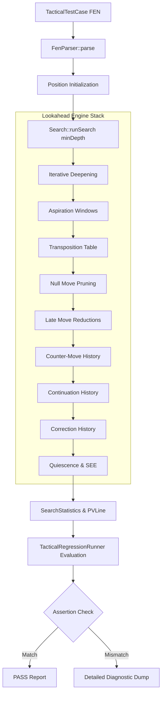

# Tactical Regression Suite — Architectural Specification & Test Harness Contract

## 1. Architectural Overview & Design Philosophy

The Boson Tactical Regression Suite (`tests/tactical/TacticalSuite.hpp`, `tests/tactical/TacticalSuite.cpp`) establishes a continuous, high-fidelity verification barrier against algorithmic regressions across search, evaluation, and move ordering subsystems.

Rather than testing isolated components with mock inputs, the tactical regression harness operates against the production lookahead stack:



### Key Design Principles

1. **Production Stack Fidelity**: Every test case executes through `Search::runSearch(pos, minDepth)`, ensuring that all pruning, reduction, extension, history heuristics, and evaluation adjustments interact under live search conditions.
2. **Non-Terminating Diagnostic Execution**: Unlike standard unit test assertion aborts, the regression runner evaluates every test case across all categories sequentially. If a regression occurs, execution continues, aggregating full diagnostics across all categories to provide an immediate complete audit.
3. **Console Stream Decoupling**: Production iterative deepening outputs detailed UCI information (`info depth ...`) and benchmark summaries to `std::cout`. The test harness employs an RAII stream redirection barrier (`CoutSilencer`) to suppress routine search telemetry while preserving rich assertion failure dumps.
4. **Multi-Solution Soundness**: Positions with multiple sound tactical refutations accept a candidate list (`std::vector<std::string_view>`), avoiding false negatives when two equivalent winning paths exist.

---

## 2. Framework Data Structures & API Contract

### `TacticalTestCase`
Defines the input contract and expectations for an individual position:

```cpp
struct TacticalTestCase {
    std::string_view name{};
    std::string_view fen{};
    std::vector<std::string_view> expectedBestMoves{};
    int minDepth{6};
    int expectedScoreMin{-32000};
    int expectedScoreMax{32000};
    bool isMate{false};
    int mateInPly{0};
};
```

| Field | Type | Description |
| :--- | :--- | :--- |
| `name` | `std::string_view` | Human-readable test identifier and tactical motif name. |
| `fen` | `std::string_view` | Valid Forsyth-Edwards Notation string defining board state. |
| `expectedBestMoves` | `std::vector<std::string_view>` | List of acceptable best moves in UCI notation (`[from][to][promo]`). |
| `minDepth` | `int` | Search depth limit passed to iterative deepening. |
| `expectedScoreMin` | `int` | Lower centipawn bound (or mate bound) for valid search evaluation. |
| `expectedScoreMax` | `int` | Upper centipawn bound (or mate bound) for valid search evaluation. |
| `isMate` | `bool` | Flag requiring evaluation to be within the mate range ($\ge \text{MATE} - 100$). |
| `mateInPly` | `int` | Nominal distance in plies to checkmate for mate horizon validation. |

### `TacticalTestResult`
Maintains execution outcome and diagnostics upon test completion:

```cpp
struct TacticalTestResult {
    bool passed{false};
    std::string testName{};
    std::string fen{};
    std::vector<std::string> expectedMoves{};
    std::string actualMove{};
    int depthSearched{0};
    int score{0};
    std::string pvString{};
    std::string failureReason{};
};
```

### Diagnostic Failure Formatting
When an assertion fails, the harness outputs structured telemetry:

```text
[ASSERTION FAILURE] Tactical Regression Failed!
  Test Name     : Core Tactics - Knight Family Fork
  FEN           : r3k2r/ppp2ppp/2n5/3N4/8/8/PPP2PPP/R3K2R w KQkq - 0 1
  Expected Moves: [d5c7]
  Actual Move   : e1g1
  Depth Searched: 4
  Eval Score    : 45 cp
  PV String      e1g1 e8c8 d5e3
  Failure Reason: Best move mismatch: expected one of [d5c7], but search selected [e1g1]
-----------------------------------------------------------------
```

---

## 3. Categorized Position Breakdown

The suite currently contains 16 curated positions distributed across three critical verification categories:

### Category 1: Mates & Mate Sequences
Focuses on exact terminal lookahead, mating distance monotonicity, and defensive evasion:

| Test Name | FEN | Expected | Depth | Type |
| :--- | :--- | :--- | :---: | :--- |
| **Scholar's Mate Finish** | `r1bqkb1r/pppp1ppp/2n5/4p3/2B1n3/5Q2/PPPP1PPP/RNB1K1NR w KQkq - 0 4` | `f3f7` | 2 | Mate in 1 |
| **Back-Rank Mate** | `6k1/5ppp/8/8/8/8/8/4R1K1 w - - 0 1` | `e1e8` | 2 | Mate in 1 |
| **King & Rook Corner Box** | `1k6/8/1K6/8/8/8/8/2R5 w - - 0 1` | `c1c7`, `c1c6`, ... | 4 | Mate in 2 |
| **Anastasia's Queen Sacrifice** | `4rr1k/4N1pp/8/7Q/8/3R4/5PPP/6K1 w - - 0 1` | `h5h7` | 4 | Mate in 2 |
| **WAC.001 Heavy Piece Strike** | `2rr2k1/1p3ppp/3p4/p2Np3/1PP1P3/2K2P2/P3q1PP/3R3R b - - 0 1` | `c8c4` | 6 | Mate in 4 |
| **Defensive Mate Evasion** | `r4rk1/pb3ppp/8/8/8/8/PPP2qPP/R1B1R2K w - - 0 1` | `e1g1` | 4 | Back-rank defense |

### Category 2: Core Tactical Motifs
Verifies piece coordination, geometry, and material refutations:

| Test Name | FEN | Expected | Depth | Target Motif |
| :--- | :--- | :--- | :---: | :--- |
| **Knight Family Fork** | `r3k2r/ppp2ppp/2n5/3N4/8/8/PPP2PPP/R3K2R w KQkq - 0 1` | `d5c7` | 4 | Royal Fork winning Rook |
| **Pawn Family Fork** | `r2qkb1r/ppp2ppp/2n1b3/4p3/3P4/2N2N2/PPP2PPP/R1BQKB1R w KQkq - 0 1` | `d4d5` | 4 | Dual-piece pawn fork |
| **Absolute Pin Exploitation** | `4k3/8/8/4n3/3P4/8/8/4R1K1 w - - 0 1` | `d4e5`, `e1e5` | 4 | Exploiting absolute file pin |
| **Absolute Rook Skewer** | `8/1q2k3/8/8/8/8/8/7R w - - 0 1` | `h1h7` | 4 | Rank-7 King-Queen skewer |
| **Discovered Attack / Check** | `3qk3/8/8/4N3/8/8/8/4R1K1 w - - 0 1` | `e5c6` | 4 | Discovered check winning Queen |
| **Back-Rank Liquidation** | `2rr2k1/5ppp/8/8/8/3R4/5PPP/3R2K1 w - - 0 1` | `d3d8`, `d1d8` | 4 | Heavy piece forced mate sequence |

### Category 3: Search Heuristic Edge Cases
Explicitly targets pruning and reduction mechanisms to prevent heuristic blindness:

| Test Name | FEN | Expected | Depth | Targeted Heuristic |
| :--- | :--- | :--- | :---: | :--- |
| **SEE Defended Pawn Avoidance** | `4k2r/p4ppp/2p1pn2/R2p4/8/8/PPP2PPP/4KB1R w Kk - 0 1` | `a5a7` | 4 | Static Exchange Evaluation (refusing `Rxd5`) |
| **NMP Zugzwang Protection** | `8/8/4k3/4p3/4P3/4K3/8/8 w - - 0 1` | `e3d3` | 4 | Pure pawn non-pawn material bypass |
| **Quiescence Stand-Pat Trap** | `r1bqkb1r/pppp1ppp/2n5/4p3/2B1n3/3P1N2/PPP2PPP/RNBQK2R w KQkq - 0 5` | `d3e4` | 4 | Standing pat vs forcing capture refutation |
| **LMR Quiet Breakthrough** | `3r2k1/5ppp/8/8/8/8/1Q3PPP/R5K1 w - - 0 1` | `a1e1`, `b2b6`, `b2a5` | 4 | Late move re-search on alpha exceedance |

---

## 4. Contract for Adding New Regression FENs

When contributing new tactical test cases to `tests/tactical/TacticalSuite.cpp`, developers must adhere to the following 5-point contract:

1. **Verified Soundness**:
   - The position must be mathematically solved or verified with a reference engine.
   - All alternate winning solutions must be listed in `expectedBestMoves`.
2. **Minimal Search Depth ($\text{minDepth} \le 6$)**:
   - The test must solve within nominal tactical horizons (depth 2 to 6).
   - Fast execution is mandatory: the entire suite must execute in $< 2$ seconds.
3. **Strict UCI Formatting**:
   - Moves must be formatted in lowercase coordinate notation (e.g., `e2e4`, `c7c8q`).
4. **Bounded Evaluation Ranges**:
   - Centipawn evaluation bounds (`expectedScoreMin`, `expectedScoreMax`) must be wide enough to tolerate minor evaluation tuning adjustments while tightly bounding the expected winning/drawing advantage.
5. **No Warning Policy**:
   - All definitions must compile under MSVC `/W4 /WX` and GCC/Clang `-Wall -Wextra -Wpedantic -Werror`.
